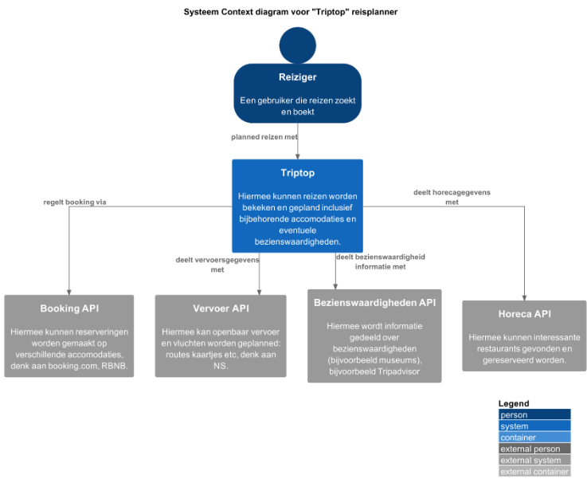

# Software Guidebook Triptop

## 1. Introduction

Dit software guidebook geeft een overzicht van de Triptop-applicatie. Het bevat een samenvatting van het volgende:

1. De vereisten, beperkingen en principes.
1. De software-architectuur, met inbegrip van de technologiekeuzes op hoog niveau en de structuur van de software.
1. De ontwerp- en codebeslissingen die zijn genomen om de software te realiseren.
1. De architectuur van de infrastructuur en hoe de software kan worden geinstalleerd.

## 2. Context

De Triptop reis planner web-applicatie biedt gebruikers een platform om hun reizen te plannen, accommodaties te boeken,
vervoer te regelen en bezienswaardigheden te ontdekken, met behulp van externe API's.
Dit systeem verzamelt de actuele data van verschillende boekings, vervoer, restaurant en bezienswaardigheidssites om zo
gebruikers te voorzien van de meest recent data voor hun reis. De applicatie maakt gebruik van de volgende
API-providers: BookingCom (scraper), TripAdvisor (scraper), TheFork, *Open Table en Stripe voor betalingen.

### Context Diagram

Gebruiker (Reiziger)

De reiziger is de primaire gebruiker van de TripTop applicatie. Ze gebruiken de applicatie om:

* Reizen te plannen via gegeven bouwstenen.
* Verschillende reisopties, accommodaties, vervoersmogelijkheden en bezienswaardigheden te bekijken.
* Reizen te boeken en beheren.

De reiziger kan samen met hulp van de reisagent de reis boeken en ook hulp krijgen bij het plannen.

Reisagent
De reisagent ondersteunt de reiziger bij het samenstellen en boeken van hun reizen. Zo kan de reiziger via de reisagent
een voorstel krijgen van een reisplan aan de hand van hun persoonlijke belangen.

Triptop App

De Triptop applicatie is het centrale systeem dat de interactie tussen de gebruiker en verschillende externe systemen
mogelijk maakt. Het systeem doet het volgende:

* Maakt het mogelijk voor de reiziger om hun reizen te plannen, accommodaties te boeken en bijbehorend vervoer te
  regelen.
* Verbindt met externe platforms via API's om zo de meest recente informatie te krijgen over de verschillende
  reisinformatie.
* Beheert boeking en maakt het eenvoudig voor de gebruiker om reizen te plannen.

Externe Systemen

Booking API (BookingCom)

* BookingCom is de externe API van waaruit alle data over accommodaties wordt opgehaald.

Airbnb API

* Alternatief voor het boeken van accommodaties.

Vervoer API's

* NS API: Voor het ophalen van de data over het openbaar vervoer (bussen en treinen) binnen Nederland.
* KLM API: Biedt vlucht informatie, waaronder tijden, prijzen en beschikbaarheid.
* Uber API: Geeft gegevens over lokale taxi's, om zo makkelijk en goedkoper te kunnen reizen.

Bezienswaardigheden API

* TripAdvisor API: Biedt informatie over bezienswaardigheden en activiteiten, als musea, parken en excursies.
* BookingCom API: Deze biedt daarnaast ook nog verschillende attractie data.

Restaurant API

* TheFork API: Voor het ophalen van restaurant data.
* OpenTable API: Alternatief voor het ophalen van data, voor een grotere selectie eetgelegenheden.

GoogleLogin (OAuth 2.0)

* Voor het eenvoudig authenticeren van de gebruikers via Google, als alternatief van de login uit het systeem zelf.

Relaties

## 3. Functional Overview

Om de belangrijkste features toe te lichten zijn er user stories en twee domain stories gemaakt en een overzicht van het
domein in de vorm van een domeinmodel. Op deze plek staat typisch een user story map maar die ontbreekt in dit
voorbeeld.

### 3.1 User Stories

#### 3.1.1 User Story 1: Reis plannen

Als gebruiker wil ik een zelfstandig op basis van diverse variabelen (bouwstenen) een reis kunnen plannen op basis van
mijn reisvoorkeuren (wel/niet duurzaam reizen, budget/prijsklasse, 's nachts reizen of overdag etc.) zodat ik op
vakantie kan gaan zonder dat hiervoor een reisbureau benodigd is.

#### 3.1.2 User Story 2: Reis boeken

Als gebruiker wil ik een geplande reis als geheel of per variabele (bouwsteen) boeken en betalen zodat ik op vakantie
kan gaan zonder dat hiervoor een reisbureau benodigd is.

#### 3.1.3 User Story 3: Reis cancelen

Als gebruiker wil ik een geboekte reis, of delen daarvan, kunnen annuleren zodat ik mijn geld terug kan krijgen zonder
inmenging van een intermediair zoals een reisbureau.

#### 3.1.4 User Story 4: Reisstatus bewaren

Als gebruiker wil ik mijn reisstatus kunnen bewaren zonder dat ik een extra account hoef aan te maken zodat ik mijn reis
kan volgen zonder dat ik daarvoor extra handelingen moet verrichten.

#### 3.1.5 User Story 5: Bouwstenen flexibel uitbreiden

Als gebruiker wil ik de bouwstenen van mijn reis flexibel kunnen uitbreiden met een zelf te managen stap (bijv. met
providers die niet standaard worden aangeboden zoals een andere reisorganisatie, hotelketen etc.) zodat ik mijn reis
helemaal kan aanpassen aan mijn wensen.

### 3.2 Domain Story Reis Boeken (AS IS)

### 3.3 Domain Story Reis Boeken (TO BE)

### 3.4 Domain Model

## 4. Quality Attributes

Voordat deze casusomschrijving tot stand kwam, heeft de opdrachtgever de volgende ISO 25010 kwaliteitsattributen benoemd
als belangrijk:

* Compatibility -> Interoperability (Degree to which a system, product or component can exchange information with other
  products and mutually use the information that has been exchanged)
* Reliability -> Fault Tolerance (Degree to which a system or component operates as intended despite the presence of
  hardware or software faults)
* Maintainability -> Modularity (Degree to which a system or computer program is composed of discrete components such
  that a change to one component has minimal impact on other components)
* Maintainability -> Modifiability (Degree to which a product or system can be effectively and efficiently modified
  without introducing defects or degrading existing product quality)
* Security -> Integrity (Degree to which a system, product or component ensures that the state of its system and data
  are protected from unauthorized modification or deletion either by malicious action or computer error)
* Security -> Confidentiality (Degree to which a system, product or component ensures that data are accessible only to
  those authorized to have access)

## 5. Constraints

> [!IMPORTANT]
> Beschrijf zelf de beperkingen die op voorhand bekend zijn die invloed hebben op keuzes die wel of niet gemaakt kunnen
> of mogen worden.

## 6. Principles

> [!IMPORTANT]
> Beschrijf zelf de belangrijkste architecturele en design principes die zijn toegepast in de software.

## 7. Software Architecture

### 7.1. Containers

> [!IMPORTANT]
> Voeg toe: Container Diagram plus een Dynamic Diagram van een aantal scenario's inclusief begeleidende tekst.

> Deze afbeelding toont een C4 Container Diagram van het systeem genaamd Triptop. Het doel van dit diagram is om te
> laten zien uit welke softwareonderdelen (containers) het systeem bestaat, hoe ze met elkaar samenwerken, en met welke
> externe systemen ze communiceren. Hieronder geef ik een heldere uitleg per onderdeel.

> Reiziger (persoon)
> Beschrijving: De gebruiker van de applicatie.
> Actie: Beheert en wijzigt zijn reis via de webapplicatie.
> Communiceert met de Triptop Web App.
> Triptop Web App (container)
> Technologie: React
> Functie: De frontend van het systeem; dit is wat de gebruiker ziet en gebruikt.
> Rol: Geeft gebruikers de mogelijkheid hun reizen te beheren en te wijzigen

> Reisbeheer API-applicatie (container)
> Technologie: Java MVC
> Functie: Dit is de backend.
> Rol: Beheert de reisdata en communicatie met externe systemen.
> Belangrijk: De frontend stuurt hier API-verzoeken naartoe.

> Database (container)
> Technologie: PostgreSQL
> Functie: Opslag van:
> Reisdata
> Gebruikersvoorkeuren
> Wijzigingen
> Relatie: Alleen de API-applicatie praat met de database.
> Hoe verloopt de interactie?
> De gebruiker opent de Triptop Web App.
> De Web App stuurt een API-verzoek naar de Reisbeheer API-applicatie.

> Deze applicatie:
> Vraagt gegevens op van externe systemen (zoals Booking.com of NS),
> laat info op of leest deze uit de database,
> Verwerkt logica en stuurt info terug naar de Web App.
> De Web App toont de informatie aan de gebruiker.

> Deze afbeelding toont een C4 Container Diagram dat zich specifiek richt op het inlogproces van Triptop.
> Het laat zien welke containers betrokken zijn bij authenticatie, en hoe gegevens van de gebruiker worden verwerkt.

> Reiziger (persoon)
> Gebruiker van Triptop.
> Start het proces door in te loggen via de webapp.

> Triptop Web App (React)
> Frontend (de webinterface).
> Verstuurt de inloggegevens van de gebruiker naar de backend.

> Reisbeheer API-applicatie (Java MVC)
> Ontvangt de inloggegevens en start het authenticatieproces.
> Stuurt uiteindelijk het gekregen token terug naar de webapp.

> Authenticatiecomponent
> Bevat de logica voor authenticatie binnen het systeem.
> Controleert gebruikersgegevens in de database, of schakelt externe providers in.

> Database (PostgreSQL)
> Bevat gebruikersgegevens.
> Wordt geraadpleegd om gebruikers op te zoeken op basis van hun gebruikersnaam en wachtwoord.

> Externe Authenticatie Service (OAuth 2.0)
> Bijv. Google login.
> Wordt ingeschakeld wanneer een gebruiker via een externe provider wil inloggen.

> Kort overzicht van de flow:

> De gebruiker logt in via de webapp.

> Inloggegevens worden naar de backend gestuurd.

> De backend vraagt authenticatie aan de authenticatiecomponent.

> Deze stuurt de gebruiker (indien nodig) door naar de externe OAuth-provider.

> De provider stuurt een token terug.

> Intern wordt gecontroleerd of deze gebruiker bestaat in de database.

> Gebruikersdata wordt opgehaald.

> De authenticatiecomponent geeft het token door aan de backend.

> De backend stuurt dit token uiteindelijk naar de webapp.

> Deze afbeelding toont een C4 Container Diagram,
> maar dan specifiek voor de "reis boeken"-feature van het Triptop-systeem. Het laat zien welke containers betrokken
> zijn
> bij het boeken van een reis en hoe de communicatie met externe APIs verloopt.

> Reiziger (persoon)
> De gebruiker van de Triptop-applicatie.
> Start dit proces door een reis te boeken.

> Triptop Web App (frontend)
> Technologie: React (JavaScript)
> Rol: Laat de gebruiker zijn reis samenstellen en verstuurt die info naar de backend.
> Gebruiker boekt een reis.
> Ontvangt uiteindelijk de betaallink of methode terug.

> Reisbeheer API-applicatie (backend)
> Rol: Verwerkt alle logica rondom het boeken van een reis.
> Ontvangt de boekingsgegevens en handelt alles verder af met externe systemen en de database.

> Database (PostgreSQL)
> Slaat alle reisdata, wijzigingen en voorkeuren van de gebruiker op.
> Wordt gebruikt tijdens en na het boekingsproces.

> Externe Systemen die de API aanroept

> Booking API (bijv. Booking.com, Airbnb)
> Voor het boeken van accommodaties.
> Boeking gerelateerde gegevens worden verstuurd.

> Vervoer API (NS, KLM, Uber)
> Voor het regelen van vervoer.
> Houdt vervoersdata bij en verwerkt wijzigingen.

> Bezienswaardigheden API (TripAdvisor, Google Places)
> Voor excursies en toeristische informatie.
> Ophalen en beheren van attracties.

> Horeca API (TheFork, OpenTable)
> Voor suggesties van restaurants en cafés.
> Gebruikt om horeca-informatie op te halen.

> Betalingsservice API (bijv. Stripe, Mollie)
> API stuurt betaallinks/transacties terug naar backend.
> De backend geeft die weer door naar de frontend.

> Kort overzicht van de flow:

> De gebruiker boekt een reis.

> Web App stuurt de reisgegevens naar de backend.

> Backend boekt hotels via Booking API.

> Backend vraagt betaling aan bij de betalingsservice.

> Frontend ontvangt link om te betalen. 6–9. Backend verwerkt extra reisdata via andere externe APIs (vervoer,
> bezienswaardigheden, horeca).

### 7.2. Components

> [!IMPORTANT]
> Voeg toe: Component Diagram plus een Dynamic Diagram van een aantal scenario's inclusief begeleidende tekst.

### 7.3. Design & Code

> [!IMPORTANT]
> Voeg toe: Per ontwerpvraag een Class Diagram plus een Sequence Diagram van een aantal scenario's inclusief
> begeleidende tekst.

## 8. Architectural Decision Records

> [!IMPORTANT]
> Voeg toe: 3 tot 5 ADR's die beslissingen beschrijven die zijn genomen tijdens het ontwerpen en bouwen van de software.

### 8.1. ADR-001 TITLE

> [!TIP]
> These documents have names that are short noun phrases. For example, "ADR 1: Deployment on Ruby on Rails 3.0.10" or "
> ADR 9: LDAP for Multitenant Integration". The whole ADR should be one or two pages long. We will write each ADR as if
> it
> is a conversation with a future developer. This requires good writing style, with full sentences organized into
> paragraphs. Bullets are acceptable only for visual style, not as an excuse for writing sentence fragments. (Bullets
> kill
> people, even PowerPoint bullets.)

#### Context

> [!TIP]
> This section describes the forces at play, including technological, political, social, and project local. These forces
> are probably in tension, and should be called out as such. The language in this section is value-neutral. It is simply
> describing facts about the problem we're facing and points out factors to take into account or to weigh when making
> the
> final decision.

#### Considered Options

> [!TIP]
> This section describes the options that were considered, and gives some indication as to why the chosen option was
> selected.

#### Decision

> [!TIP]
> This section describes our response to the forces/problem. It is stated in full sentences, with active voice. "We
> will …"

#### Status

> [!TIP]
> A decision may be "proposed" if the project stakeholders haven't agreed with it yet, or "accepted" once it is agreed.
> If a later ADR changes or reverses a decision, it may be marked as "deprecated" or "superseded" with a reference to
> its
> replacement.

#### Consequences

> [!TIP]
> This section describes the resulting context, after applying the decision. All consequences should be listed here, not
> just the "positive" ones. A particular decision may have positive, negative, and neutral consequences, but all of them
> affect the team and project in the future.

### 8.2. ADR-002 TITLE

> [!TIP]
> These documents have names that are short noun phrases. For example, "ADR 1: Deployment on Ruby on Rails 3.0.10" or "
> ADR 9: LDAP for Multitenant Integration". The whole ADR should be one or two pages long. We will write each ADR as if
> it
> is a conversation with a future developer. This requires good writing style, with full sentences organized into
> paragraphs. Bullets are acceptable only for visual style, not as an excuse for writing sentence fragments. (Bullets
> kill
> people, even PowerPoint bullets.)

#### Context

> [!TIP]
> This section describes the forces at play, including technological, political, social, and project local. These forces
> are probably in tension, and should be called out as such. The language in this section is value-neutral. It is simply
> describing facts about the problem we're facing and points out factors to take into account or to weigh when making
> the
> final decision.

#### Considered Options

> [!TIP]
> This section describes the options that were considered, and gives some indication as to why the chosen option was
> selected.

#### Decision

> [!TIP]
> This section describes our response to the forces/problem. It is stated in full sentences, with active voice. "We
> will …"

#### Status

> [!TIP]
> A decision may be "proposed" if the project stakeholders haven't agreed with it yet, or "accepted" once it is agreed.
> If a later ADR changes or reverses a decision, it may be marked as "deprecated" or "superseded" with a reference to
> its
> replacement.

#### Consequences

> [!TIP]
> This section describes the resulting context, after applying the decision. All consequences should be listed here, not
> just the "positive" ones. A particular decision may have positive, negative, and neutral consequences, but all of them
> affect the team and project in the future.

### 8.3. ADR-003 TITLE

> [!TIP]
> These documents have names that are short noun phrases. For example, "ADR 1: Deployment on Ruby on Rails 3.0.10" or "
> ADR 9: LDAP for Multitenant Integration". The whole ADR should be one or two pages long. We will write each ADR as if
> it
> is a conversation with a future developer. This requires good writing style, with full sentences organized into
> paragraphs. Bullets are acceptable only for visual style, not as an excuse for writing sentence fragments. (Bullets
> kill
> people, even PowerPoint bullets.)

#### Context

> [!TIP]
> This section describes the forces at play, including technological, political, social, and project local. These forces
> are probably in tension, and should be called out as such. The language in this section is value-neutral. It is simply
> describing facts about the problem we're facing and points out factors to take into account or to weigh when making
> the
> final decision.

#### Considered Options

> [!TIP]
> This section describes the options that were considered, and gives some indication as to why the chosen option was
> selected.

#### Decision

> [!TIP]
> This section describes our response to the forces/problem. It is stated in full sentences, with active voice. "We
> will …"

#### Status

> [!TIP]
> A decision may be "proposed" if the project stakeholders haven't agreed with it yet, or "accepted" once it is agreed.
> If a later ADR changes or reverses a decision, it may be marked as "deprecated" or "superseded" with a reference to
> its
> replacement.

#### Consequences

> [!TIP]
> This section describes the resulting context, after applying the decision. All consequences should be listed here, not
> just the "positive" ones. A particular decision may have positive, negative, and neutral consequences, but all of them
> affect the team and project in the future.

### 8.4. ADR-004 TITLE

> [!TIP]
> These documents have names that are short noun phrases. For example, "ADR 1: Deployment on Ruby on Rails 3.0.10" or "
> ADR 9: LDAP for Multitenant Integration". The whole ADR should be one or two pages long. We will write each ADR as if
> it
> is a conversation with a future developer. This requires good writing style, with full sentences organized into
> paragraphs. Bullets are acceptable only for visual style, not as an excuse for writing sentence fragments. (Bullets
> kill
> people, even PowerPoint bullets.)

#### Context

> [!TIP]
> This section describes the forces at play, including technological, political, social, and project local. These forces
> are probably in tension, and should be called out as such. The language in this section is value-neutral. It is simply
> describing facts about the problem we're facing and points out factors to take into account or to weigh when making
> the
> final decision.

#### Considered Options

> [!TIP]
> This section describes the options that were considered, and gives some indication as to why the chosen option was
> selected.

#### Decision

> [!TIP]
> This section describes our response to the forces/problem. It is stated in full sentences, with active voice. "We
> will …"

#### Status

> [!TIP]
> A decision may be "proposed" if the project stakeholders haven't agreed with it yet, or "accepted" once it is agreed.
> If a later ADR changes or reverses a decision, it may be marked as "deprecated" or "superseded" with a reference to
> its
> replacement.

#### Consequences

> [!TIP]
> This section describes the resulting context, after applying the decision. All consequences should be listed here, not
> just the "positive" ones. A particular decision may have positive, negative, and neutral consequences, but all of them
> affect the team and project in the future.

### 8.5. ADR-005 TITLE

> [!TIP]
> These documents have names that are short noun phrases. For example, "ADR 1: Deployment on Ruby on Rails 3.0.10" or "
> ADR 9: LDAP for Multitenant Integration". The whole ADR should be one or two pages long. We will write each ADR as if
> it
> is a conversation with a future developer. This requires good writing style, with full sentences organized into
> paragraphs. Bullets are acceptable only for visual style, not as an excuse for writing sentence fragments. (Bullets
> kill
> people, even PowerPoint bullets.)

#### Context

> [!TIP]
> This section describes the forces at play, including technological, political, social, and project local. These forces
> are probably in tension, and should be called out as such. The language in this section is value-neutral. It is simply
> describing facts about the problem we're facing and points out factors to take into account or to weigh when making
> the
> final decision.

#### Considered Options

> [!TIP]
> This section describes the options that were considered, and gives some indication as to why the chosen option was
> selected.

#### Decision

> [!TIP]
> This section describes our response to the forces/problem. It is stated in full sentences, with active voice. "We
> will …"

#### Status

> [!TIP]
> A decision may be "proposed" if the project stakeholders haven't agreed with it yet, or "accepted" once it is agreed.
> If a later ADR changes or reverses a decision, it may be marked as "deprecated" or "superseded" with a reference to
> its
> replacement.

#### Consequences

> [!TIP]
> This section describes the resulting context, after applying the decision. All consequences should be listed here, not
> just the "positive" ones. A particular decision may have positive, negative, and neutral consequences, but all of them
> affect the team and project in the future.

## 9. Deployment, Operation and Support

> [!TIP]
> Zelf beschrijven van wat je moet doen om de software te installeren en te kunnen runnen.