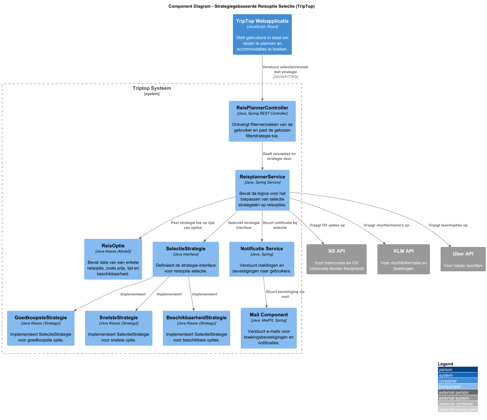
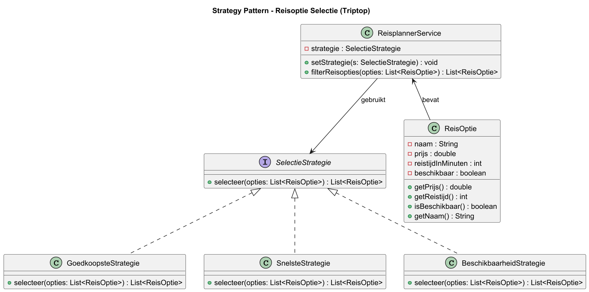
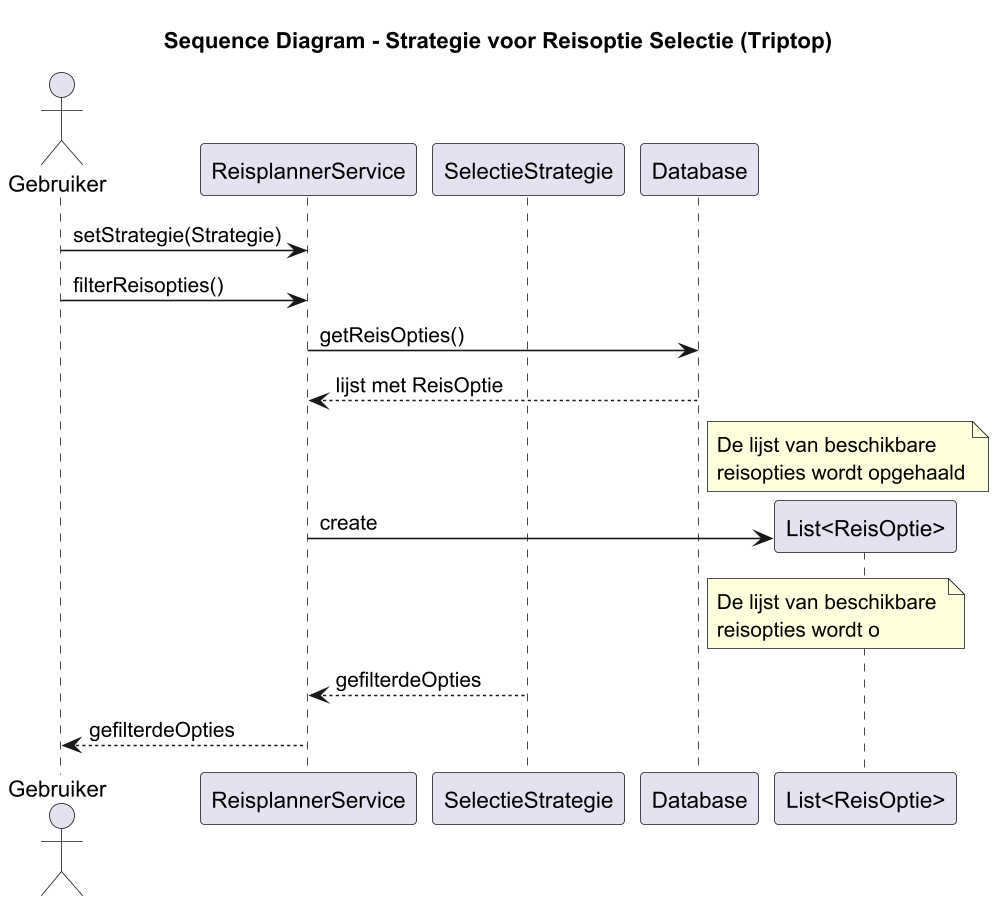
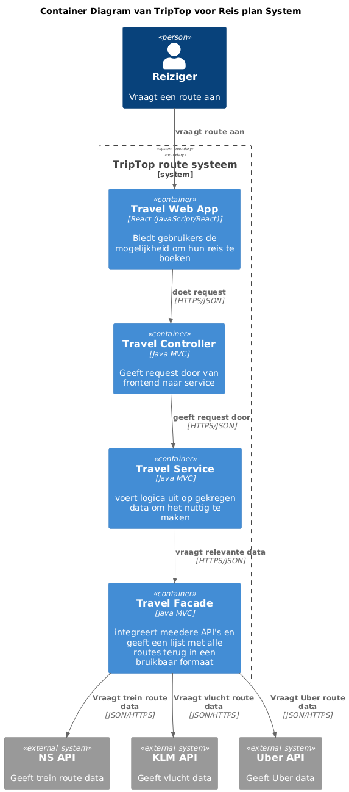
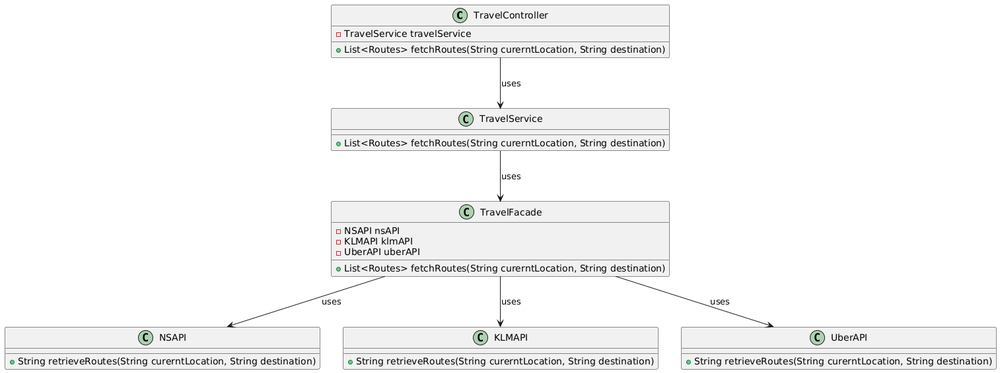
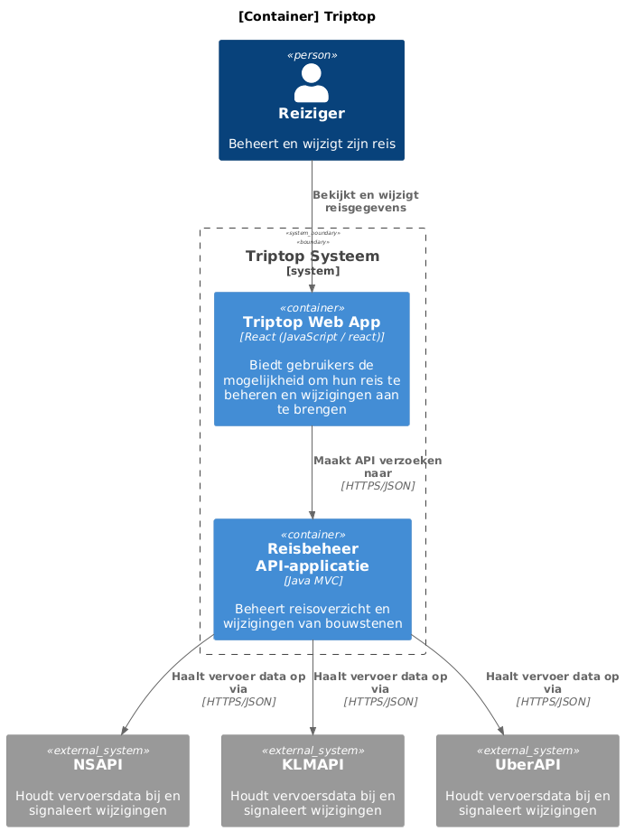
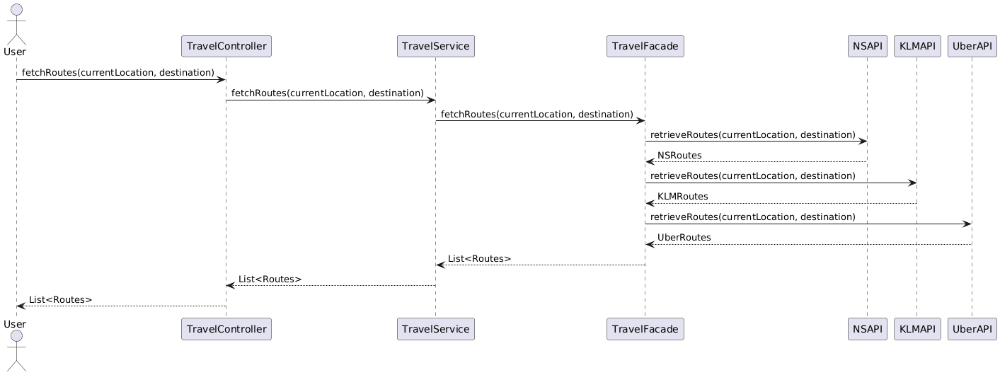

# Software Guidebook Triptop

## 1. Introduction

Dit software guidebook geeft een overzicht van de Triptop-applicatie. Het bevat een samenvatting van het volgende:

1. De vereisten, beperkingen en principes.
1. De software-architectuur, met inbegrip van de technologiekeuzes op hoog niveau en de structuur van de software.
1. De ontwerp- en codebeslissingen die zijn genomen om de software te realiseren.
1. De architectuur van de infrastructuur en hoe de software kan worden geinstalleerd.

## 2. Context

De Triptop reis planner web-applicatie biedt gebruikers een platform om hun reizen te plannen, accommodaties te boeken,
vervoer te regelen en bezienswaardigheden te ontdekken, met behulp van externe API's.
Dit systeem verzamelt de actuele data van verschillende boekings, vervoer, restaurant en bezienswaardigheidssites om zo
gebruikers te voorzien van de meest recent data voor hun reis. De applicatie maakt gebruik van de volgende
API-providers: BookingCom (scraper), TripAdvisor (scraper), TheFork, Open Table en Stripe voor betalingen.

### Context Diagram

Afbeelding 1 Context Diagram

#### Toelichting:

Gebruiker (Reiziger)

De reiziger is de primaire gebruiker van de TripTop applicatie. Ze gebruiken de applicatie om:

* Reizen te plannen via gegeven bouwstenen.
* Verschillende reisopties, accommodaties, vervoersmogelijkheden en bezienswaardigheden te bekijken.
* Reizen te boeken en beheren.

De reiziger kan samen met hulp van de reisagent de reis boeken en ook hulp krijgen bij het plannen.

Reisagent
De reisagent ondersteunt de reiziger bij het samenstellen en boeken van hun reizen. Zo kan de reiziger via de reisagent
een voorstel krijgen van een reisplan aan de hand van hun persoonlijke belangen.

Triptop App

De Triptop applicatie is het centrale systeem dat de interactie tussen de gebruiker en verschillende externe systemen
mogelijk maakt. Het systeem doet het volgende:

* Maakt het mogelijk voor de reiziger om hun reizen te plannen, accommodaties te boeken en bijbehorend vervoer te
  regelen.
* Verbindt met externe platforms via API's om zo de meest recente informatie te krijgen over de verschillende
  reisinformatie.
* Beheert boeking en maakt het eenvoudig voor de gebruiker om reizen te plannen.

Externe Systemen

Booking API (BookingCom)

* BookingCom is de externe API van waaruit alle data over accommodaties wordt opgehaald.

Airbnb API

* Alternatief voor het boeken van accommodaties.

Vervoer API's

* NS API: Voor het ophalen van de data over het openbaar vervoer (bussen en treinen) binnen Nederland.
* KLM API: Biedt vlucht informatie, waaronder tijden, prijzen en beschikbaarheid.
* Uber API: Geeft gegevens over lokale taxi's, om zo makkelijk en goedkoper te kunnen reizen.

Bezienswaardigheden API

* TripAdvisor API: Biedt informatie over bezienswaardigheden en activiteiten, als musea, parken en excursies.
* BookingCom API: Deze biedt daarnaast ook nog verschillende attractie data.

Restaurant API

* TheFork API: Voor het ophalen van restaurant data.
* OpenTable API: Alternatief voor het ophalen van data, voor een grotere selectie eetgelegenheden.

GoogleLogin (OAuth 2.0)

* Voor het eenvoudig authenticeren van de gebruikers via Google, als alternatief van de login uit het systeem zelf.

## 3. Functional Overview

Om de belangrijkste features toe te lichten zijn er user stories en twee domain stories gemaakt en een overzicht van het
domein in de vorm van een domeinmodel. Op deze plek staat typisch een user story map maar die ontbreekt in dit
voorbeeld.

### 3.1 User Stories

#### 3.1.1 User Story 1: Reis plannen

Als gebruiker wil ik een zelfstandig op basis van diverse variabelen (bouwstenen) een reis kunnen plannen op basis van
mijn reisvoorkeuren (wel/niet duurzaam reizen, budget/prijsklasse, 's nachts reizen of overdag etc.) zodat ik op
vakantie kan gaan zonder dat hiervoor een reisbureau benodigd is.

#### 3.1.2 User Story 2: Reis boeken

Als gebruiker wil ik een geplande reis als geheel of per variabele (bouwsteen) boeken en betalen zodat ik op vakantie
kan gaan zonder dat hiervoor een reisbureau benodigd is.

#### 3.1.3 User Story 3: Reis cancelen

Als gebruiker wil ik een geboekte reis, of delen daarvan, kunnen annuleren zodat ik mijn geld terug kan krijgen zonder
inmenging van een intermediair zoals een reisbureau.

#### 3.1.4 User Story 4: Reisstatus bewaren

Als gebruiker wil ik mijn reisstatus kunnen bewaren zonder dat ik een extra account hoef aan te maken zodat ik mijn reis
kan volgen zonder dat ik daarvoor extra handelingen moet verrichten.

#### 3.1.5 User Story 5: Bouwstenen flexibel uitbreiden

Als gebruiker wil ik de bouwstenen van mijn reis flexibel kunnen uitbreiden met een zelf te managen stap (bijv. met
providers die niet standaard worden aangeboden zoals een andere reisorganisatie, hotelketen etc.) zodat ik mijn reis
helemaal kan aanpassen aan mijn wensen.

### 3.2 Domain Story Reis Boeken (AS IS)

### 3.3 Domain Story Reis Boeken (TO BE)

### 3.4 Domain Model

## 4. Quality Attributes

Voordat deze casusomschrijving tot stand kwam, heeft de opdrachtgever de volgende ISO 25010 kwaliteitsattributen benoemd
als belangrijk:

* Compatibility -> Interoperability (Degree to which a system, product or component can exchange information with other
  products and mutually use the information that has been exchanged)
* Reliability -> Fault Tolerance (Degree to which a system or component operates as intended despite the presence of
  hardware or software faults)
* Maintainability -> Modularity (Degree to which a system or computer program is composed of discrete components such
  that a change to one component has minimal impact on other components)
* Maintainability -> Modifiability (Degree to which a product or system can be effectively and efficiently modified
  without introducing defects or degrading existing product quality)
* Security -> Integrity (Degree to which a system, product or component ensures that the state of its system and data
  are protected from unauthorized modification or deletion either by malicious action or computer error)
* Security -> Confidentiality (Degree to which a system, product or component ensures that data are accessible only to
  those authorized to have access)

## 5. Constraints

- Ons proof of concept wordt gemaakt met Java en Spring Boot  
  Omdat we hier het meeste kennis van hebben en het voor ons duidelijkst is hoe we dingen moeten aanpassen.
- De applicatie moet een REST API zijn  
  Hier hebben we als groep het meeste ervaring mee en kunnen daarom het proof of concept het beste uitwerken als een
  REST API.
- Data wordt overgedragen via HTTP/JSON  
  In onze ervaring past dit het beste bij een REST API.
- De applicatie moet een webapplicatie worden  
  Deze keuze hebben we gemaakt omdat de applicatie waar we de frontend op baseren ook een webapplicatie is.

## 6. Principles

# Interface Segregation Principle (ISP)

### Waarom gebruiken we het ISP?

Het Interface Segregation Principle helpt ons duidelijk te maken welk onderdeel welke verantwoordelijkheden heeft en
welke interface daarbij hoort. Dit maakt het makkelijker om te zien welke klassen afhankelijk zijn van welke onderdelen,
en zorgt ervoor dat klassen alleen afhankelijk zijn van de interfaces die ze daadwerkelijk gebruiken.

### Hoe past het ISP toe?

In plaats van één interface met veel verantwoordelijkheden, splits je deze op in meerdere, gerichte interfaces. Hierdoor
implementeren klassen alleen de methodes die relevant zijn voor hun specifieke taken.

---

# Single Responsibility Principle (SRP)

### Waarom gebruiken we het SRP?

Het SRP zorgt ervoor dat de interfaces zo specifiek mogelijk zijn, zodat de klassen die deze implementeren alleen de
relevante methodes hoeven te implementeren en niet een groot aantal onnodige methodes.

### Hoe past het SRP toe?

Bij onze code hebben we dit principe toegepast door taken op te splitsen. Bijvoorbeeld, voor het boeken hebben we een
controller voor de communicatie met de front-end, een service voor de logica op de verkregen data, en een facade om data
van een API op te schonen en door te geven.

### Waarom is het belangrijk?

Door de code op te splitsen op basis van functionaliteit zorg je ervoor dat er minder fouten ontstaan, aangezien elke
klasse slechts één verantwoordelijkheid draagt. Dit verhoogt de overzichtelijkheid, omdat je gericht kunt zoeken naar de
functionaliteit die je wilt aanpassen of debuggen. Bovendien zorgt het ervoor dat je beter nadenkt over de structuur van
je code, omdat niet alles in één enkele klasse wordt gedaan, maar op een logische en overzichtelijke manier is
opgesplitst.

---

# Open Closed Principle (OCP)

### Waarom gebruiken we het OCP?

Het Open Closed Principle stelt dat code open moet zijn voor uitbreiding, maar gesloten voor aanpassing. Dit betekent
dat we nieuwe functionaliteiten kunnen toevoegen zonder de bestaande code te wijzigen, wat het risico op bugs
vermindert.

### Waarom is het belangrijk?

- **Voorkomt bugs in bestaande code**
- **Maakt het makkelijk om nieuwe functionaliteit toe te voegen**
- **Verbetert onderhoud en testbaarheid**

### Voorbeeld (zoals bij TripTop):

Als we een nieuwe filterstrategie willen toevoegen, kunnen we eenvoudig een nieuwe klasse toevoegen zonder de oude code
aan te passen. Hierdoor blijft de bestaande functionaliteit intact en kunnen we de nieuwe functionaliteit uitbreiden
zonder risico's.

### Kortom:

Het OCP zorgt voor stabiele, uitbreidbare en onderhoudsvriendelijke software.

## 7. Software Architecture

### 7.1. Containers

Dit diagram is een Container Diagram van het TripTop-systeem en laat zien hoe de verschillende onderdelen (containers)
van het systeem samenwerken, en hoe ze communiceren met externe systemen.

#### Toelichting

Acteur

* Reiziger: De eindgebruiker van het systeem. Deze persoon stelt reizen samen, boekt accommodaties en beheert zijn reis.

Binnen het TripTop systeem

* Triptop Web App (React)
  Frontend van de applicatie.
  Hier beheert de gebruiker zijn reis.
  Stuurt via JSON/HTTPS verzoeken naar de backend.

Reisbeheer API-applicatie (Java MVC)

* Backend van het systeem.
  Ontvangt API-verzoeken van de frontend.
  Verwerkt reisgegevens, regelt boekingen en beheert wijzigingen van de reis.

Database (PostgreSQL):

* Slaat alle gebruikersdata, voorkeuren, boekingen en wijzigingen op.
  Alleen toegankelijk voor de backend, niet voor de gebruiker of externe APIs.

Externe systemen (APIs)

* De backend communiceert met verschillende externe APIs om gegevens op te halen of acties uit te voeren:
  Bookingcom API & Airbnb API: Voor het boeken van accommodaties.

* NS API, KLM API & Uber API: Voor vervoersinformatie (trein, vlucht, taxi).

* TripAdvisor API: Voor bezienswaardigheden en excursies.

* TheFork API & OpenTable API: Voor horecagegevens, zoals restaurants en cafés.

Google Login (OAuth 2.0)

* Voor authenticatie van gebruikers.Frontend van de applicatie.
  Hier beheert de gebruiker zijn reis.
  Stuurt via JSON/HTTPS verzoeken naar de backend.
  
  

### 7.2. Components

Afbeelding n Component Diagram

#### Toelichting Component Diagram:

Hieronder worden hoofdfunctionaliteiten uit component diagram beschreven. De componenten werken samen om de volgende
functionaliteiten van de applicatie te ondersteunen. De gebruiker heeft toegang tot deze functionaliteiten door middel
van de TripTop Webapplicatie.

Authenticatie

* Login Controller: Dit component verwerkt de aanmeldingen van gebruikers en authenticatieverzoeken. Het maakt het
  mogelijk voor gebruiker om in te loggen via hun TripTop-account of via de externe OAuth-API welke inloggen via Google
  mogelijk maakt.
* Beveiliging Component: Dit zorgt voor de validatie van de inloggegevens (e-mail en wachtwoord) van de gebruikers.
* Authenticatie Repository: Slaat de gebruikers data op als de gebruiker inlogt via een TripTop-account, dit is niet
  nodig als de gebruiker inlogt via Google deze heeft hiervoor een eigen database.
  Het gebruik van de Google login API maakt het makkelijker voor gebruikers om in te loggen, zonder een nieuw account te
  hoeven aanmaken.
  Betaling
* Betaal Controller: Dit component regelt de betalingsverzoeken. Het genereert de betaling URL’s voor de gebruiker.

Stripe API is gekozen voor het veilig en efficiënt verwerken van de betalingen, wat interne betalingssystemen overbodig
maakt.

Boeking

* Boeking Controller: regelt inkomende boekingsverzoeken van de gebruiker en stuurt de gewenste informatie terug.
* Decider: Dit component maakt gebruik van het State Pattern waarmee wordt bepaald welke boekingsopties beschikbaar
  zijn.
  Reisplanning
* Verzoeken voor reisplanning gaan via de reisplanner controller, deze kan vervolgens doorgaan de Reisplannerservice
  waaruit verschillende strategieën (strategy pattern) kunnen gekozen voor de reis: BeschikbaarheidsStrategie,
  GoedkoopsteStrategie en SnelsteStrategie.

Notificaties

* Via de Notificatie Service worden de verschillende meldingen van Triptop verstuurd onder andere boekingsbevestigingen
  en reisinformatie. De mails worden verstuur met ons eigen mail component.
  Externe Systemen
* De backend maakt gebruik van verschillende externe systemen, zoals de Stripe API (voor betalingsverzoeken), NS API (
  voor treindata), KLM API (voor vlucht data), Uber API (voor lokale taxi’s), en meerdere bezienswaardigheid en broeking
  API’s (BookingCom API en TripAdvisor API).
  Door gebruik te maken van verschillende externe API’s, kan Triptop gebruik maken van recente data met betrekking tot
  reizen, waaronder accommodatie, vervoer en bezienswaardigheden.

### 7.3. Design & Code

#### Adapter pattern

Het gebruik van het Adapter pattern in TripTop is gebaseerd op het Architectural Decision Record - 002 Gebruik van
Adapter Pattern met betrekking tot bezienswaardigheden, waarin is vastgesteld dat het adapter pattern de beste manier is
om de integratie van externe services te beheren. Dit zorgt er namelijk voor dat het ophalen van de data uit de API's
flexibel gaat en aanpassingen aan API niet leiden tot grote veranderingen in de applicatie.

Het Adapter pattern helpt bij het beantwoorden van de volgende onderzoeksvragen:

* Hoe zorg je ervoor dat je bij een wijziging in de datastructuur van een externe service niet de hele applicatie hoeft
  aan te passen?
* Hoe zorg je ervoor dat je makkelijk een nieuwe externe service kan toevoegen?

##### Component Diagram:

Het onderstaande component diagram weergeeft de complete integratie van het adapter-pattern in het Triptop systeem.
Hierin is zijn de adapter uitwerkingen van zowel van bezienswaardigheden als accommodaties te zien. Er is gekozen om
hier het adapter-pattern te gebruiken om zo mogelijk uitbreidingen (meer externe platformen) gemakkelijker te maken.

Afbeelding n Component Diagram Adapter pattern (Alleen de relevante componenten)

##### Klasse diagram:

Het onderstaande klassen diagram laat zien hoe in de applicatie het adapter pattern wordt toegepast, specifiek met
betrekking tot bezienswaardigheden (Attractions). Naast bezienswaardigheden wordt dit ook toegepast op
accommodaties zoals te zien is in het component-diagram. De "AttractionAdapter" interface abstraheert het gedrag van de
verschillende bezienswaardigheden providers, in dit geval BookingCom en TripAdvisor. Door deze interface te gebruiken is
het mogelijk om verschillende dataproviders toe te voegen en aan te passen, zonder de hele serviceklasse te hoeven
veranderen.

Het klassen-diagram hieronder weergeeft de architectuur van hoe het Adapter pattern wordt gebruikt om data van
verschillende bezienswaardigheid providers te verwerken.

Toelichting:

* AttractionAdapter interface: Deze interface definieert de methodes getAttractions() om de verschillende
  bezienswaardigheid data op te halen en getName() om de naam van de provider op te halen. Deze interface maakt het
  mogelijk om voor verschillende dataproviders adapters te maken die dezelfde methode implementeren.
* AttractionService: Deze klasse zorgt ervoor dat de data uit de verschillende bezienswaardigheid adapters samen wordt
  gevoegd tot een lijst voor een overzicht van alle mogelijk bezienswaardigheden op de gegeven locatie.

Afbeelding n Klasse Diagram Adapter pattern

##### Sequentie Diagram Adapter pattern

Het sequentie-diagram hieronder toont hoe de bezienswaardigheidsadapter verloopt.

Toelichting:

1. De gebruiker vraagt bezienswaardigheden voor een specifieke locatie op, dit gaat via AttractionService.
2. AttractionService vraagt de data op van BookingComAdapter.
3. De adapter haalt de raw data op van de BookingComApi klasse.
4. Hetzelfde proces wordt herhaald voor de TripAdvisorAdapter.
5. Als beide lijsten van bezienswaardigheden zijn opgehaald, worden deze samengevoegd tot een lijst.

Afbeelding n Sequentie Diagram Adapter pattern

---

#### Strategy Patroon

Het Strategy Pattern is toegepast om gebruikers van TripTop flexibel te laten kiezen hoe hun reisopties worden
gefilterd. Denk hierbij aan het selecteren van de **goedkoopste**, **snelste**, of gewoon **beschikbare** optie.

Deze aanpak sluit aan bij de volgende ontwerpvraag:

> **"Hoe zorg je voor een zo kort mogelijke reisroute waarbij gebruik gemaakt wordt van alle bouwstenen?  
> Hoe zorg je ervoor dat de reisroute makkelijk aangepast kan worden als reisafstand geen issue is?"**

Door strategieën los te trekken van de rest van het systeem, kunnen we gedrag eenvoudig wisselen, uitbreiden en testen.

---

#### Component Diagram

Het onderstaande component diagram laat zien hoe de strategiekeuze door de gebruiker via de controller wordt verwerkt en
doorgegeven aan de service. Deze past vervolgens de gekozen strategie toe op een lijst met reisopties.

De drie concrete strategieën zijn:

GoedkoopsteStrategie

SnelsteStrategie

BeschikbaarheidStrategie

Deze structuur sluit direct aan op het ADR-keuzen-in-strategy waarin gekozen is voor het Strategy Pattern om flexibele
route-optimalisatie mogelijk te maken.
Door de strategie los te koppelen van de service (Separation of Concerns), kunnen we nieuwe strategieën toevoegen zonder
bestaande code aan te passen — wat perfect aansluit
bij het Open/Closed Principle zoals benoemd in het ADR.

Daarnaast ondersteunt dit componentdiagram de ontwerpvraag uit het ADR:

“Hoe zorg je ervoor dat de reisroute makkelijk aangepast kan worden als reisafstand geen issue is?”
Afbeelding Component Diagram Strategy Patroon (Alleen de relevante componenten)  

##### Klasse diagram

Het klassen-diagram hieronder toont hoe het Strategy Pattern is opgebouwd:

De SelectieStrategie interface zorgt ervoor dat alle strategieklassen dezelfde methode selecteer() implementeren. Dit
maakt het systeem flexibel en stelt de ReisplannerService in staat om tijdens runtime van gedrag te wisselen.

Elke concrete strategie (zoals GoedkoopsteStrategie) bevat zijn eigen logica. Dit maakt elke strategie afzonderlijk
testbaar, wat een belangrijk punt is uit het ADR.

De ReisplannerService werkt op de interface (SelectieStrategie) en niet op specifieke implementaties — dit is een
directe toepassing van het principe “Program to interfaces, not implementations” zoals benoemd in het ADR.

Deze aanpak zorgt ervoor dat:

Nieuwe strategieën zoals “eco-vriendelijk” of “kindvriendelijk” eenvoudig kunnen worden toegevoegd (uitbreidbaarheid).

De bestaande code onaangetast blijft bij toevoegingen of wijzigingen (Open/Closed Principle).

Gedrag eenvoudig te wijzigen is zonder afhankelijk te zijn van de concrete klassen (Dependency Inversion Principle).

Afbeelding Klasse Diagram Strategy Patroon  

##### Sequentie Diagram

Het sequentie-diagram laat het runtime gedrag van het Strategy Pattern zien binnen TripTop:

De gebruiker stuurt een strategie en een lijst met reisopties.

De controller kiest de juiste strategie (bijv. “snelste”) en stelt deze in op de service.

De service gebruikt de gekozen strategie om de lijst te filteren.

De gebruiker ontvangt het resultaat.

Deze flow maakt duidelijk dat de logica volledig verschoven is naar de strategieklassen. De controller en service
blijven generiek en herbruikbaar. Dit is een concrete toepassing van het Separation of Concerns principe, wat als
voordeel benoemd is in het ADR.

Daarnaast biedt dit ontwerp ruimte voor uitbreiding, zoals beschreven in het ADR:

Strategieën zijn verwisselbaar tijdens runtime, afhankelijk van gebruikersvoorkeur.

Nieuwe scenario’s zijn eenvoudig toe te voegen met minimale impact op bestaande code.
Afbeelding n Sequentie Diagram Strategy Patroon  

---

#### State pattern

Het State pattern helpt bij het beantwoorden van de volgende onderzoeksvragen:

* Hoe bied je de gebruiker op basis van zelfgekozen bouwstenen alternatieve bouwstenen aan, bijvoorbeeld als een
  bepaalde overnachting niet beschikbaar is of om een keuze te geven tussen vervoer per auto, trein o

##### Component Diagram:

Alle logica van de aplicatie na de decider staat in
Booking Component. Denk hierbij aan. Wat gebeurt er als er
wel of geen kamers beschikbaar zijn

Afbeelding n Component Diagram State

##### Klasse diagram:

In dit klasse diagram kan je zien hoe ik de State pattern heb toegepast.
Ik heb gekozen om dit uit te werken met de ontwerpvraag "Hoe bied je de gebruiker op basis van zelfgekozen bouwstenen
alternatieve bouwstenen aan, bijvoorbeeld als een bepaalde overnachting niet beschikbaar is of om een keuze te geven
tussen vervoer per auto, trein of bus?"
Ik heb gekozen voor gekozen om voor
een interface "State" gekozen omdat ik dit onderdeel vaker gebruik
en het ook direct kan verbinden met de decider
De parameters die de controller nodig heeft die komen vanuit bij het request via
Postman.
In het ADR geef ik als nadeel aan dat er extra classes gebruikt worden wanneer dit pattern gebruikt word en dit zoe je
goed terug in mijn klasse diagram

Afbeelding n Klasse Diagram State Pattern

##### Sequentie Diagram State pattern

In dit diagram kan je duidelijk zien wat er wanneer geberut
Er word veel vanuit de BookingController gedaan
en pas daarna word er beslist wat er gebeurt.
Hiernaast word alles duidelijk in het diagram aangegeven
In het ADR geef ik aan dat het voordeel is dat elke klasse zijn eigen functionaliteit heeft.
Dit kan je in het Sequentie diagram goed terug zien

Afbeelding n Sequentie Diagram State pattern

#### Facade Pattern

##### Component diagram

component diagram voor reis-boek systeem met facade pattern

Het component diagram laat zien welke componenten door het route systeem gebruikt gaan worden. Er wordt hier gebruik
gemaakt van een facade om de response van de API te verwerken
Er wordt hier gebruik gemaakt van een controller voor het krijgen van request van de front-end, een service om iets met
de data te doen, een facade om alle API responces als lijst aan de service te geven,
en als laatste 3 API's die mogelijke routes meegeven aan de facade. De keuze achter de facade wordt in ADR005
beredeneerd.

##### Class diagram

class diagram voor reis-boek systeem met facade pattern

Dit diagram laat de classes zien die gebruikt worden voor het boeken van vervoer. Er wordt hier gebruik gemaakt van een
facade om er voor te zorgen dat er zonder moeite API’s kunnen worden toegevoegd en dit naar door kan worden gegeven aan
de service.
Er wordt hier gebruik gemaakt van een controller voor het krijgen van request van de front-end, een service om iets met
de data te doen, een facade om alle API responces als lijst aan de service te geven,
en als laatste 3 API's die mogelijke routes meegeven aan de facade. De keuze achter de facade wordt in ADR005
beredeneerd.

##### Container diagram

container diagram voor reis-boek systeem met gebruik van facade pattern

Het container diagram laat de vervoer boek functionaliteit in hoofdlijnen zien. Hier wordt gebruik gemaakt van de front
en backend, de actor en API’s relevant aan deze functionaliteit

##### Sqeuence diagram

sequence diagram voor reis-boek systeem met facade pattern

Het sequentie diagram laat zien hoe er door de code heen gelopen worden. Hier worden alle componenten met de calls
ertussen laten zien. er wordt gebruik gemaakt van een facade om de api responces op te halen en schoon te maken voor
gebruik voor de service.
De keuze achter de facade wordt in ADR005 beredeneerd.

- de gebruiker stuurt met de frontend een request naar de controller
- de controller vraagt de informatie van de service aan
- de service vraagt de API data van de facade
- de facade gaat alle API's af een stuurt een lijst met data
- de facade stuurt de data terug naar de service
- de service stuurt de data naar de contoller
- de gebruiker krijgt de data te zien

## 8. Architectural Decision Records

### 8.1. ADR-001 Keuze voor PostgreSQL als databasesysteem

**Datum:** 21-03-2025  
**Status:** Geaccepteerd

---**Datum:** 31-03-2025  
**Status:**  ACCEPTED

---

## Context

Binnen het TripTop-project willen we op een flexibele manier kunnen omgaan met verchillende logica bij bijvoorbeeld het
kiezen van reisopties of betalingsverwerking.
Er zijn meerdere patterns beschikbaar om dit bereiken. Daarom hebben we vier bekende design patterns overwogen, Deze
patterns moesten we toepassen als prototype:

## Overwogen Opties

| Voordelen                                                                                                                                                                           | Nadelen                                                                                                                                                                                                     |
|-------------------------------------------------------------------------------------------------------------------------------------------------------------------------------------|-------------------------------------------------------------------------------------------------------------------------------------------------------------------------------------------------------------|
| Duidelijkheid: De verantwoordelijkheden worden duidelijk gescheden hierdoor is het goed en makkelijk om te zien welk onderdeel waarvoor verantwoordelijk is                     | Aantal klassen:  Omdat elke state zijn eigen klasse is heb je erg veel extra klasse nodig omdat elk onderdeel of state zijn eigen klasse heeft                                                          |
| Makkelijk uit te breiden:  Wanneer je State gebruikt is het makkelijk om je project uit te breiden. Het enige wat je moet doen is een nieuwe state aan je project toe te voegen | Testen: Het is moeilijker om je code te Unit testen. Dit is omdat je ervoor moet zorgen dat de code die je wilt testen in de juiste state zit wanneer je deze test.                                     |
| Makkelijk te debuggen:  Aangezien elk onderdeel een duidelijke functie heeft is het makkelijk om te debuggen omdat het erg duidelijk is welk onderdeel wat doen.                | Niet goed voor kleine projecten: Dit pattern is niet goed om te gebruiken bij kleinere projecten. Hier kwam ik met mijn prototype achter. Het project werd alleen maar onnodig groter en ingewikkelder. |

## Beslissing

Bij mijn designvraag werkte de pattern erg goed. Ik kon hiermee snel hetgene maken wat ik wilde en de state werd fijn
beigehouden vanuit andere classes. De pattern paste goed bij mijn vraag en ik kon hierom snel veder. hetgeen wat ik wel
moeilijk vond aan dit onderdeel is dat state een beetje overkill was

---

## Gevolgen

Er worden meer states gebruikt en klasse worden aangeroepen gebasseerd op wat er aan de state word terug gegeven. Dit is
fijn want er is een soort van centrale plek die over de onderdelen gaat. Het nadeel is wel dat het allemaal stap voor
stap gaat en het pas niet goed bij elk onderdeel.

#### Context

Voor het TripTop-project moeten we een databasesysteem kiezen dat voldoet aan onze eisen op het gebied van:

- Data consistentie en integriteit
- Schaalbaarheid en prestaties
- Flexibiliteit in datamodellering
- Ondersteuning voor complexe queries
- Onderhoud en beheer

We hebben vier systemen vergeleken: **PostgreSQL**, **MongoDB**, **CouchDB** en **Neo4J**.

---

#### Overwogen opties

| Kracht                                  | PostgreSQL | MongoDB | CouchDB | Neo4J |
|-----------------------------------------|------------|---------|---------|-------|
| **Data Consistentie en Integriteit**    | ++         | 0       | 0       | +     |
| **Schaalbaarheid en Prestaties**        | 0          | +       | -       | +     |
| **Flexibiliteit in Data Modellering**   | 0          | +       | +       | ++    |
| **Ondersteuning voor Complexe Query's** | ++         | ++      | -       | +     |
| **Onderhoud en Beheer**                 | ++         | ++      | +       | +     |
| **Leercurve**                           | +          | +       | -       | 0     |

---

#### Beslissing

We kiezen voor **PostgreSQL** als databaseoplossing voor TripTop, op basis van de volgende overwegingen:

##### Data Consistentie en Integriteit

Voor een reisboekingssysteem is betrouwbaarheid cruciaal. PostgreSQL biedt volledige ACID-compliance, wat voorkomt dat
boekingsdata verloren of corrupt raakt.

##### Ondersteuning voor Complexe Queries

Omdat TripTop veel datarelaties bevat (bijv. tussen boekingen, gebruikers, locaties, voorkeuren), is geavanceerde
query-ondersteuning nodig. PostgreSQL biedt hierin robuuste SQL-functionaliteiten.

---

#### Gevolgen

##### Voordelen

- **Betrouwbare transacties:** PostgreSQL is ACID-compliant, wat essentieel is voor betrouwbare boekingen.
- **Sterke query-ondersteuning:** Complexe data-opvragingen en analyses zijn goed mogelijk.
- **Actieve community:** Veel ondersteuning en documentatie beschikbaar.

##### Nadelen

- **Minder flexibel bij ongestructureerde data** dan NoSQL-oplossingen.

### 8.2. ADR-002 Gebruik van Adapter Pattern met betrekking tot bezienswaardigheden

**Datum:** 31-03-2025  
**Status:** Geaccepteerd

#### Context

We willen de adapter pattern gebruiken om de volgende ontwerpvragen te beantwoorden:

* Hoe zorg je ervoor dat je bij een wijziging in de datastructuur van een externe service niet de hele applicatie hoeft
  aan te passen?
* Hoe zorg je ervoor dat je makkelijk een nieuwe externe service kan toevoegen?

In dit geval om BookingCom en tripAdvisor te integreren. Deze API's leveren de data in verschillende formaten, waardoor
het moeilijk is om de data
consistent weer te gegeven binnen ons systeem.

Daarnaast maakt dit ook gebruik van de volgende design principes:
Single Responsibility Principle (SRP)

* De adapter pattern isoleert de interactie tussen de verschillende API's. Door deze elk een eigen Adapter klasse te
  geven.
* Deze isolering zorgt ervoor dat alleen deze klasse hoeven worden aangepast als er veranderingen zijn aan de API.

Interface Segregation Principle (ISP)

* De Adapter interface voor bezienswaardigheden defineert alleen de benodigde methodes, dit zorgt ervoor dat klasse die
  dit implementeren geen irrelevant functionaliteiten hoeven te ondersteunen.

Open/Closed Principle (OCP)

* Het adapter pattern zorgt ervoor dat er makkelijk nieuwe externe services kunnen worden toegevoegd zonder hiervoor een
  groot deel bestaande code te hoeven aanpassen.

#### Overwogen Opties

| Voordelen                                                                                                                                                              | Nadelen                                                                                                                                                                                 |
|------------------------------------------------------------------------------------------------------------------------------------------------------------------------|-----------------------------------------------------------------------------------------------------------------------------------------------------------------------------------------|
| Integratie: Het maakt integratie van verschillende API's (met verschillende data formaten) makkelijker, zonder hiervoor (veel) bestaande code te moeten aanpassen. | Complexiteit: Het verhoogt de complexiteit binnen de applicatie: voor iedere API moet ten minste één extra class worden toegevoegd.                                                 |
| Onderhoud: Het toepassen van dit pattern maakt het makkelijker om de code te onderhouden en uit te breiden.                                                        | Flexibiliteit: Het koppelen van de API's aan een interface kan de flexibiliteit beperken, maar er kan gebruik worden gemaakt van meerder adapters om dit te verhelpen.              |
| Consistentie: Het zorgt ervoor dat de data van alle bronnen in hetzelfde formaat wordt geformatteerd.                                                              | Tijd: Het kost in het begin extra tijd om dit pattern te implementeren, maar uiteindelijk kan het tijd besparen, doordat het implementeren van nieuwe API's veel eenvoudiger wordt. |

#### Beslissing

We hebben besloten om dit pattern toe te passen in ons systeem, zodat we de data gestructureerd op kunnen halen, en zo
makkelijker de bezienswaardigheid data op te halen.

#### Status

Geaccepteerd

#### Gevolgen

Dit pattern maakt het mogelijk om data van verschillende providers te integreren zonder hoofdfunctionaliteiten van het
systeem aan te passen. Daarnaast zorgt het voor consistentie binnen de applicatie.

### ADR-003 Waarom kiezen voor het Strategy Pattern

**Datum:** 28-03-2025  
**Status:** Geaccepteerd

---

### Context

In TripTop willen we flexibel omgaan met keuzes van gebruikers. Denk aan dingen zoals:

- Wil de gebruiker de **goedkoopste**, **snelste** of **meest beschikbare** reisoptie?
- Moet er betaald worden via **Stripe**, **iDEAL**, of een andere provider?

Voor al die gevallen heb je verschillende strategieën om je gekozen doel te bereiken.
Ook zijn hierbij belangrijke designprincipes toegepast zoals Single Responsibility Principle (SRP) en Open Closed
Principle (OCP).

### Ontwerp vraag

**"Hoe zorg je voor een zo kort mogelijke reisroute waarbij gebruik gemaakt wordt van alle bouwstenen?
Hoe zorg je ervoor dat de reisroute makkelijk aangepast kan worden als reisafstand geen issue is?"**

---

### Overwogen Aspecten – Strategy Pattern voor Routeplanning

| Aspect                                     | Voordelen                                                                                                             | Nadelen                                                             |
|--------------------------------------------|-----------------------------------------------------------------------------------------------------------------------|---------------------------------------------------------------------|
| **Flexibele route-optimalisatie**          | Strategieën kunnen gebaseerd zijn op o.a. tijd, afstand, beschikbaarheid of voorkeuren                                | Vereist meerdere strategieklassen voor elk type logica              |
| **Aanpasbaarheid op gebruikerswens**       | Gebruiker of systeem kan tijdens runtime bepalen welke route-logica gebruikt moet worden                              | Meer logica om gebruikerskeuze om te zetten naar juiste strategie   |
| **Scheidt routeberekening van logica**     | Route-algoritmes zitten los van de rest van de business logica (Separation of Concerns)                               | Kans op duplicatie als niet goed gedeeld wordt tussen strategieën   |
| **Uitbreidbaarheid met nieuwe scenario’s** | Nieuwe soorten routevoorkeuren (bijv. “eco”, “sightseeing first”, “geen overnachtingen”) zijn makkelijk toe te voegen | Kan verwarrend worden als het aantal strategieën te groot wordt     |
| **Testbaarheid van routestrategieën**      | Elke routestrategie is zelfstandig te testen, los van UI en andere systemen                                           | Afhankelijk van mockdata of simulatie voor complete route-validatie |

---

### Toegepaste Design Principles

Single Responsibility Principle (SRP)
Elke klasse heeft één duidelijke verantwoordelijkheid. Bijvoorbeeld:

De ReisplannerController is verantwoordelijk voor communicatie met de front-end.

De ReisplannerService verwerkt de reisopties.

Elke strategieklasse doet precies één ding: bepalen op basis van een criterium wat de juiste reisoptie is.

Voor externe APIs wordt een aparte facade gebruikt om data op te schonen en bruikbaar te maken voor de rest van het
systeem.

We hebben dit principe toegepast door eerst te analyseren welke stappen nodig zijn in een proces (zoals data ophalen,
opschonen, verwerken en terugsturen), en deze logischerwijs op te splitsen in aparte klassen. Hierdoor is de code
overzichtelijker, minder foutgevoelig en makkelijker te onderhouden of aan te passen.

### Open Closed Principle (OCP)

De strategieklassen zijn hier een goed voorbeeld van OCP:

Ze zijn open voor uitbreiding — je kunt altijd een nieuwe strategie toevoegen.

Maar ze zijn gesloten voor aanpassing — bestaande code hoeft niet gewijzigd te worden bij uitbreidingen.

In de context van TripTop betekent dit:

Wil je een nieuwe strategie (zoals een milieuvriendelijke optie)? Dan voeg je gewoon een nieuwe klasse toe die
SelectieStrategie implementeert.

Geen wijzigingen in bestaande logica, dus minder kans op bugs.

Dit maakt de code testbaarder, uitbreidbaar en stabiel.

---

### Beslissing

Met deze overwegingen in gedachten gaan het strategy pattern toepassen op deze technologie.

Dit patroon is handig als je hetzelfde probleem op meerdere manieren wilt oplossen. Je stopt elke manier in een losse
klasse, en je kunt makkelijk wisselen
tussen die strategieën zonder dat je de rest van de code moet aanpassen.

---

### Wat betekent dit?

### Voordelen

- Makkelijk uit te breiden: wil je in de toekomst een extra strategie (bijv. eco-vriendelijk reizen of iets anders
  raars)? Dan voeg je gewoon een nieuwe klasse toe.
- Je hoeft niet meer `if`-jes en `switch`es in te bouwen voor elk geval.
- De logica zit vanaf nu netjes los van de rest van je code.
- Je kunt het ook goed testen per strategie.

### Nadelen

- Je gaat wat meer losse klassen hebben in je project.
- Je moet het patroon wel even snappen, anders wordt het rommelig.

---

Kortom: met Strategy kunnen we flexibel gedrag netjes organiseren, zonder dat de code een rommeltje wordt. En dat past
goed bij hoe TripTop in elkaar zit.

### 8.4. ADR-004 Waarom kiezen voor het State pattern

**Datum:** 31-03-2025  
**Status:**  ACCEPTED

---

## Context

Binnen het TripTop-project willen we op een flexibele manier kunnen omgaan met verchillende logica bij bijvoorbeeld het
kiezen van reisopties of betalingsverwerking.
Er zijn meerdere patterns beschikbaar om dit bereiken. Daarom hebben we vier bekende design patterns overwogen, Deze
patterns moesten we toepassen als prototype:

## Ontwerpvraag

Hoe bied je de gebruiker op basis van zelfgekozen bouwstenen alternatieve bouwstenen aan, bijvoorbeeld als een bepaalde
overnachting niet beschikbaar is of om een keuze te geven tussen vervoer per auto, trein o

## Overwogen Opties

| Voordelen                                                                                                                                                                           | Nadelen                                                                                                                                                                                                     |
|-------------------------------------------------------------------------------------------------------------------------------------------------------------------------------------|-------------------------------------------------------------------------------------------------------------------------------------------------------------------------------------------------------------|
| Duidelijkheid: De verantwoordelijkheden worden duidelijk gescheden hierdoor is het goed en makkelijk om te zien welk onderdeel waarvoor verantwoordelijk is                     | Aantal klassen:  Omdat elke state zijn eigen klasse is heb je erg veel extra klasse nodig omdat elk onderdeel of state zijn eigen klasse heeft                                                          |
| Makkelijk uit te breiden:  Wanneer je State gebruikt is het makkelijk om je project uit te breiden. Het enige wat je moet doen is een nieuwe state aan je project toe te voegen | Testen: Het is moeilijker om je code te Unit testen. Dit is omdat je ervoor moet zorgen dat de code die je wilt testen in de juiste state zit wanneer je deze test.                                     |
| Makkelijk te debuggen:  Aangezien elk onderdeel een duidelijke functie heeft is het makkelijk om te debuggen omdat het erg duidelijk is welk onderdeel wat doen.                | Niet goed voor kleine projecten: Dit pattern is niet goed om te gebruiken bij kleinere projecten. Hier kwam ik met mijn prototype achter. Het project werd alleen maar onnodig groter en ingewikkelder. |

## Beslissing

Bij mijn designvraag werkte de pattern erg goed. Ik kon hiermee snel hetgene maken wat ik wilde en de state werd fijn
beigehouden vanuit andere classes. De pattern paste goed bij mijn vraag en ik kon hierom snel veder. hetgeen wat ik wel
moeilijk vond aan dit onderdeel is dat state een beetje overkill was

In de code zelf kan je zie ndat ik gebruik maak van het single responsibility principle dit doe ik door te zerge dat elk onderdee verantwoordelijk is voor een ding
Wat ik hiernaast ook heb ik ook Interface Segregation Principle in mijn code staan. Dit kan je zien omdat mijn interface ene duidelijke taak heeft en niet een grote algemene interface is

---

## Gevolgen

Er worden meer states gebruikt en klasse worden aangeroepen gebasseerd op wat er aan de state word terug gegeven. Dit is
fijn want er is een soort van centrale plek die over de onderdelen gaat. Het nadeel is wel dat het allemaal stap voor
stap gaat en het pas niet goed bij elk onderdeel.

### 8.5. ADR-005 Keuze design pattern makkelijk wijzigen van API

**Datum:** 03-04-2025  
**Status:**  ACCEPTED

---

## Context

Hoe zorg je dat een wijziging in een of meerdere APIs niet leidt tot een grote wijziging in de applicatie?
Specifieker: hoe zorg je ervoor dat een wijziging in de API van een externe service niet leidt tot
een wijziging in de front-end maar flexibel kan worden opgevangen door de back-end?

## Overwogen opties

- adapter pattern

### voordelen

- overzichtelijkheid: een facade is een enkele klasse waarmee de opsgeschoonde data van de API kan worden doorgegeven
- consistentie: de facade zorgt er voor dat alle logica voor het opschonen en formatteren van de request op een centrale
  plek staat
- geen effect op andere code: de facade zorgt er voor dat alle requests bij elkaar komen en als een lijst worden
  teruggegeven.
  het verwijderen of toevoegen van API's heeft dus geen effect op andere code.

### Nadelen

- minder bruikbaar voor andere, soortgelijke systemen: de facade pattern is specifiek voor een enkele use case en kan
  hier niet op worden aangepast
- moeilijke te debuggen: alles logica voor het verzamelen en debuggen staat in een enkele klassen wat debuggen
  moeilijker kan maken

## Beslissing

De fascade zorgt er voor dat alle data die een API meegeeft eerst wordt opgeschoond voordat deze wordt doorgegeven aan
code die dit nodig heeft, hierdoor kunnen API's ook makkelijk worden toegevoegd zonder dat er grote aanpassingen gemaakt
hoeven te worden aan de back- of front-end code zelf.

De facade geeft altijd een lijst met alle mogelijke reizen op een bruikbare manier terug aan de service. dit zorgt er
voor dat er in princiepe 0 aanpassingen gemaakt hoeven te worden aan de backend code, de code wordt namelijk al in de
facade opgeschoond en in de lijst gezet met de andere API's

hoewel de facade veel voordelen met zich mee brengt heeft het alsnog ook zijn nadelen. Een groot nadeel is dat de code
onoverzichtelijk wordt
als er gebruik wordt gemaakt van te veel API's. dit kan als gevolg hebben dat de applicatie moeilijker wordt om te
debuggen. in dit opzicht was de adapter pattern
dus beter geweest.

## Gevolgen

Door gebruik te maken van de facade pattern krijgen relevante service classes een overzichtelijke lijst van alle
mogelijke routes, van alle API's.
dit zorgt er voor dat de service class het makkelijk kan verwerken en terug kan geven naar de gebruiker. Doordat er
gebruik is gemaakt van een facade hoeft er geen
gebruik gemaakt te worden van meerdere API's calls, alleen de facade hoeft aangeroepen te worden voor alle resultaten
van alle reis API's.
Dit heeft ook als effect dat aanpassingen in de API's geen gevolgen hebben voor de backend code waardoor er op dat vlak
ook
minder fout kan gaan.

In de code zelf wofrdt ook gebruik gemaakt van het single responsibility principle. er is dus ervoor gezorgd dat iedere
class maar 1 unctie draagt. in dit geval is de functie die de facade draagt om de API responce op te schonen zodat deze
probleemloos door de service gebruikt kan worden, zonder dat er door het aanpassen van 1 functie de functies elders
aangepast hoeven te worden, in dit geval de service.

## 9. Deployment, Operation and Support

Adapter (Jeroen):GET http://localhost:8081/api/attractions/Nijmegen

Strategy (Reno):POST http://localhost:8081/reisopties/filter
- Body (raw): {
"strategie": "snelste",
"reisopties": [
{
"naam": "Auto",
"prijs": 50.0,
"reistijdInMinuten": 120,
"beschikbaar": true
},
{
"naam": "Trein",
"prijs": 30.0,
"reistijdInMinuten": 90,
"beschikbaar": false
},
{
"naam": "Bus",
"prijs": 20.0,
"reistijdInMinuten": 180,
"beschikbaar": true
}
]
}

State (Marijn):GET http://localhost:8081/checkAvailability?checkin=2026-04-02&checkout=2026-04-05&hotelId=5218600&adults=1

Facade (Bohdain):GET  http://localhost:8081/travel/routes?currentLocation=cuijk&destination=nijmegen