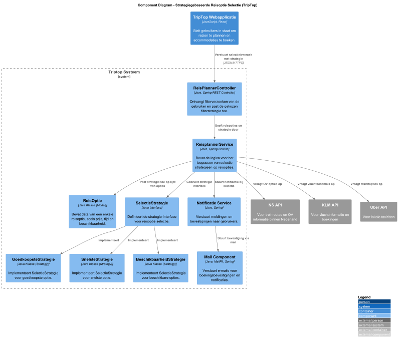
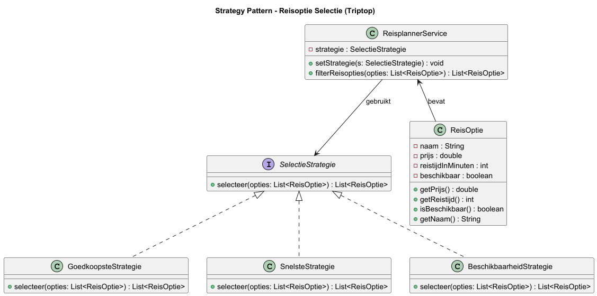
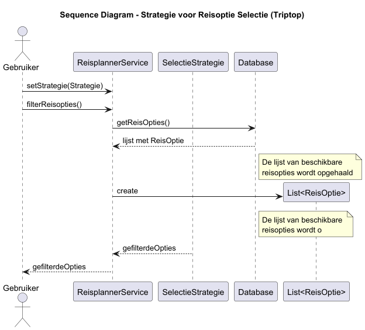

# Software Guidebook Triptop

## 1. Introduction
Dit software guidebook geeft een overzicht van de Triptop-applicatie. Het bevat een samenvatting van het volgende: 
1. De vereisten, beperkingen en principes. 
1. De software-architectuur, met inbegrip van de technologiekeuzes op hoog niveau en de structuur van de software. 
1. De ontwerp- en codebeslissingen die zijn genomen om de software te realiseren.
1. De architectuur van de infrastructuur en hoe de software kan worden geinstalleerd. 

## 2. Context

De Triptop reis planner web-applicatie biedt gebruikers een platform om hun reizen te plannen, accommodaties te boeken,
vervoer te regelen en bezienswaardigheden te ontdekken, met behulp van externe API's.
Dit systeem verzamelt de actuele data van verschillende boekings, vervoer, restaurant en bezienswaardigheidssites om zo
gebruikers te voorzien van de meest recent data voor hun reis. De applicatie maakt gebruik van de volgende
API-providers: BookingCom (scraper), TripAdvisor (scraper), TheFork, Open Table en Stripe voor betalingen.

### Context Diagram

Afbeelding 1 Context Diagram

#### Toelichting:

Gebruiker (Reiziger)

De reiziger is de primaire gebruiker van de TripTop applicatie. Ze gebruiken de applicatie om:

* Reizen te plannen via gegeven bouwstenen.
* Verschillende reisopties, accommodaties, vervoersmogelijkheden en bezienswaardigheden te bekijken.
* Reizen te boeken en beheren.

De reiziger kan samen met hulp van de reisagent de reis boeken en ook hulp krijgen bij het plannen.

Reisagent
De reisagent ondersteunt de reiziger bij het samenstellen en boeken van hun reizen. Zo kan de reiziger via de reisagent
een voorstel krijgen van een reisplan aan de hand van hun persoonlijke belangen.

Triptop App

De Triptop applicatie is het centrale systeem dat de interactie tussen de gebruiker en verschillende externe systemen
mogelijk maakt. Het systeem doet het volgende:

* Maakt het mogelijk voor de reiziger om hun reizen te plannen, accommodaties te boeken en bijbehorend vervoer te
  regelen.
* Verbindt met externe platforms via API's om zo de meest recente informatie te krijgen over de verschillende
  reisinformatie.
* Beheert boeking en maakt het eenvoudig voor de gebruiker om reizen te plannen.

Externe Systemen

Booking API (BookingCom)

* BookingCom is de externe API van waaruit alle data over accommodaties wordt opgehaald.

Airbnb API

* Alternatief voor het boeken van accommodaties.

Vervoer API's

* NS API: Voor het ophalen van de data over het openbaar vervoer (bussen en treinen) binnen Nederland.
* KLM API: Biedt vlucht informatie, waaronder tijden, prijzen en beschikbaarheid.
* Uber API: Geeft gegevens over lokale taxi's, om zo makkelijk en goedkoper te kunnen reizen.

Bezienswaardigheden API

* TripAdvisor API: Biedt informatie over bezienswaardigheden en activiteiten, als musea, parken en excursies.
* BookingCom API: Deze biedt daarnaast ook nog verschillende attractie data.

Restaurant API

* TheFork API: Voor het ophalen van restaurant data.
* OpenTable API: Alternatief voor het ophalen van data, voor een grotere selectie eetgelegenheden.

GoogleLogin (OAuth 2.0)

* Voor het eenvoudig authenticeren van de gebruikers via Google, als alternatief van de login uit het systeem zelf.

## 3. Functional Overview

Om de belangrijkste features toe te lichten zijn er user stories en twee domain stories gemaakt en een overzicht van het domein in de vorm van een domeinmodel. Op deze plek staat typisch een user story map maar die ontbreekt in dit voorbeeld.

### 3.1 User Stories

#### 3.1.1 User Story 1: Reis plannen

Als gebruiker wil ik een zelfstandig op basis van diverse variabelen (bouwstenen) een reis kunnen plannen op basis van mijn reisvoorkeuren (wel/niet duurzaam reizen, budget/prijsklasse, 's nachts reizen of overdag etc.) zodat ik op vakantie kan gaan zonder dat hiervoor een reisbureau benodigd is.

#### 3.1.2 User Story 2: Reis boeken

Als gebruiker wil ik een geplande reis als geheel of per variabele (bouwsteen) boeken en betalen zodat ik op vakantie kan gaan zonder dat hiervoor een reisbureau benodigd is.

#### 3.1.3 User Story 3: Reis cancelen

Als gebruiker wil ik een geboekte reis, of delen daarvan, kunnen annuleren zodat ik mijn geld terug kan krijgen zonder inmenging van een intermediair zoals een reisbureau.

#### 3.1.4 User Story 4: Reisstatus bewaren 

Als gebruiker wil ik mijn reisstatus kunnen bewaren zonder dat ik een extra account hoef aan te maken zodat ik mijn reis kan volgen zonder dat ik daarvoor extra handelingen moet verrichten.

#### 3.1.5 User Story 5: Bouwstenen flexibel uitbreiden

Als gebruiker wil ik de bouwstenen van mijn reis flexibel kunnen uitbreiden met een zelf te managen stap (bijv. met providers die niet standaard worden aangeboden zoals een andere reisorganisatie, hotelketen etc.) zodat ik mijn reis helemaal kan aanpassen aan mijn wensen.

### 3.2 Domain Story Reis Boeken (AS IS)

### 3.3 Domain Story Reis Boeken (TO BE)

### 3.4 Domain Model

## 4. Quality Attributes

Voordat deze casusomschrijving tot stand kwam, heeft de opdrachtgever de volgende ISO 25010 kwaliteitsattributen benoemd als belangrijk:
* Compatibility -> Interoperability (Degree to which a system, product or component can exchange information with other products and mutually use the information that has been exchanged)
* Reliability -> Fault Tolerance (Degree to which a system or component operates as intended despite the presence of hardware or software faults)
* Maintainability -> Modularity (Degree to which a system or computer program is composed of discrete components such that a change to one component has minimal impact on other components)
* Maintainability -> Modifiability (Degree to which a product or system can be effectively and efficiently modified without introducing defects or degrading existing product quality)
* Security -> Integrity (Degree to which a system, product or component ensures that the state of its system and data are protected from unauthorized modification or deletion either by malicious action or computer error)
* Security -> Confidentiality (Degree to which a system, product or component ensures that data are accessible only to those authorized to have access)

## 5. Constraints

- Ons proof of concept wordt gemaakt met Java en Spring Boot  
  Omdat we hier het meeste kennis van hebben en het voor ons duidelijkst is hoe we dingen moeten aanpassen.
- De applicatie moet een REST API zijn  
  Hier hebben we als groep het meeste ervaring mee en kunnen daarom het proof of concept het beste uitwerken als een REST API.
- Data wordt overgedragen via HTTP/JSON  
  In onze ervaring past dit het beste bij een REST API.
- De applicatie moet een webapplicatie worden  
  Deze keuze hebben we gemaakt omdat de applicatie waar we de frontend op baseren ook een webapplicatie is.

 

## 6. Principles

- Single Responsibility (SRP)
  - Ook zorgen we er voor de interfaces zo specifiek mogelijk zijn, zodat classes die deze implementeren alleen de relevante methode hoeven te implementeren en niet een groot aantal onnodige methodes.

  - waar 		
    - wij hebben bij al onze code dit principe geprobeerd toe te passen. Wi hebben bijvoorbeeld voor het boeken gebruik gemaakt van een controller voor de communicatie met de front-end, de service om logica op gekregen data uit te voeren en een facade om data van een API op te schonen en door te geven
  - Hoe 		
    - wij hebben dit principe toegepast door te kijken naar wat er gebeurt moet worden en deze op te splitsen. Bij het verwerken van data moet er data opgehaald worden, opgeschoond en bruikbaar gemaakt worden ,de data moet verwerkt worden, en dit moet ergens geplaatst worden. Dit zijn allemaal functies waarmee je de code op kan splitsen
  - waarom		
    - door de code op te splitsen op functionaliteit zorg je er voor dat er minder fout kan gaan, elke class draagt namelijk maar 1 verantwoordelijkheid. Daarnaast geeft dit ook meer overzichtelijkheid omdat je bij de code kan zoeken naar de functionaliteit die je aan wilt passen of wilt debuggen. als laatste zorgt dit er voor dat je beter over je code na moet denken omdat niet alles in een enkele class gedaan wordt, maar op een logische manier moet worden opgesplitst 


 

## 7. Software Architecture

###     7.1. Containers

Dit diagram is een Container Diagram van het TripTop-systeem en laat zien hoe de verschillende onderdelen (containers) van het systeem samenwerken, en hoe ze communiceren met externe systemen.

Acteur
Reiziger: De eindgebruiker van het systeem. Deze persoon stelt reizen samen, boekt accommodaties en beheert zijn reis.

Binnen het TripTop systeem
Triptop Web App (React):
Frontend van de applicatie.
Hier beheert de gebruiker zijn reis.
Stuurt via JSON/HTTPS verzoeken naar de backend.

Reisbeheer API-applicatie (Java MVC):
Backend van het systeem.
Ontvangt API-verzoeken van de frontend.
Verwerkt reisgegevens, regelt boekingen en beheert wijzigingen van de reis.

Database (PostgreSQL):
Slaat alle gebruikersdata, voorkeuren, boekingen en wijzigingen op.
Alleen toegankelijk voor de backend, niet voor de gebruiker of externe APIs.

Externe systemen (APIs)

De backend communiceert met verschillende externe APIs om gegevens op te halen of acties uit te voeren:
Bookingcom API & Airbnb API: Voor het boeken van accommodaties.

NS API, KLM API & Uber API: Voor vervoersinformatie (trein, vlucht, taxi).

TripAdvisor API: Voor bezienswaardigheden en excursies.

TheFork API & OpenTable API: Voor horecagegevens, zoals restaurants en cafés.

Google Login (OAuth 2.0): Voor authenticatie van gebruikers.Frontend van de applicatie.
Hier beheert de gebruiker zijn reis.
Stuurt via JSON/HTTPS verzoeken naar de backend.

Dit diagram gaat over de inlog functionaliteit van TripTop, er is hier besloten gebruik te maken een OAuth 2.0 service. Dit is de meest gebruikte authenticatie manier op dit moment. Wij maken daarnaast ook gebruik van onze eigen database. de reden hiervoor staat niet in het diagram zelf maar dit wordt gebruik om ook onze eigen authenticatie te kunnen regelen, zodat gebruikers niet verplicht een externe service moeten gebruiken.

Er is hier gebruik gemaakt van de web app voor de gebruikers interface, de API applicatie voor het ophalen van requests van de webapp en teruggeven van relevante data, een database voor het ophalen en opslaan van users en de externa api om ook een externe login provider aan te kunnen bieden.

Dit diagram gaat over de reis boek functionaliteit van TripTop. Voor het boeken van een reis maken wij gebruik van een simpele applicatie die data van meerdere API’s ophaalt, dit verwerkt en terug stuurt naar de gebruiker.

Er is hier gebruik gemaakt van de web app voor de gebruikers interface, de API applicatie voor het ophalen van requests van de webapp, het opvragen van relevante data van externe API's en teruggeven van relevante data.
Daarnaast is er ook gebruik gemaakt van de volgende externe API's:
- BookingCom API: voor het reserveren van accomodaties via Booking.com
- Airbnb API: voor het reserveren van accomodaties via Airbnb
- NS API: voor het opzoeken, inzien en boeken van trein tickets
- KLM API: voor het opzoeken, inzien en boeken van vluchten
- Uber API: voor het boeken van uber ritten
- TripAdvisor API: voor opvragen van toeristische informatie en excursies
- Stripe API: voor betaalmogelijkheid binnen TripTop
- TheFork API: voor het opzoeken en reserveren van restaurants
- OpenTable API: voor het opzoeken en reserveren van restaurants

###     7.2. Components

Afbeelding n Component Diagram 

Wat zien we hier?
TripTop Webapplicatie (React)
De gebruiker gebruikt deze frontend om z’n reis samen te stellen. Alles wat hij invoert (reisvoorkeuren, boekingen, etc.) wordt doorgestuurd naar de backend.

Belangrijke componenten in de backend
Login + Beveiliging
Login Controller verwerkt inlogpogingen.

Beveiliging Component controleert wachtwoorden etc.

Authenticatie Repository slaat gebruikersgegevens op.

Boeking Functionaliteit
Boeking Controller regelt inkomende boekingsverzoeken.

Boeking Component doet de logica erachter.

Boeking Repository regelt het ophalen en opslaan in de database.

Betalingen
Betaal Controller start het betaalproces.

Betaal Component verwerkt dat.

Betaal Repository slaat het op.

Accommodaties
Accommodatie Beheer verwerkt de data.

Accommodatie Repository slaat het lokaal op.

Notificaties
Notificatie Service stuurt meldingen.

Mail Component verstuurt e-mails (via MailPit bijv.).

Nieuwe toegevoegde onderdelen:

ReisplannerService: kiest de juiste strategie (bijv. snelste route).
ReisPlannerController: ontvangt het verzoek van de gebruiker met hun voorkeur.

Strategie Klassen:

GoedkoopsteStrategie, SnelsteStrategie en BeschikbaarheidStrategie. SelectieStrategie is de interface die dit allemaal verbindt.

ReisOptie is het model dat al die info bevat (zoals prijs, reistijd, beschikbaarheid).

Deze onderdelen zorgen ervoor dat het systeem op basis van gebruikersvoorkeuren zelf kan bepalen welke reisoptie het beste past.

Toelichting:
De Accommodatie Beheer component vormt een soort tussenlaag tussen:

Business logica (Booking Component)

Database interactie (Accommodatie Repository)

Waarom is dat handig?
Duidelijke scheiding van verantwoordelijkheden
In plaats van dat de Booking Component direct zelf queries doet of weet hoe accommodaties opgeslagen moeten worden, laat je dat over aan Accommodatie Beheer. Daardoor blijft de Booking Component puur gefocust op logica zoals: "welke accommodatie past bij deze reis?" en niet "hoe sla ik deze in de database?"

Makkelijker uitbreiden
Stel dat je straks ook accommodaties uit een andere externe API wilt halen (zoals een eigen TripTop CMS of een Bookingcom scraper), dan kun je dat in de Accommodatie Beheer toevoegen zonder dat je de Booking Component hoeft te wijzigen. Dat houdt je code modulair.

Data transformatie
Deze tussenlaag kan data formatteren of omzetten voordat het de database ingaat of eruit komt. Bijvoorbeeld: data van de Bookingcom API omzetten naar het juiste interne model voordat het wordt opgeslagen.

Herbruikbaarheid
Als meerdere onderdelen van je backend (bijv. een admin dashboard of een scraper) toegang willen tot accommodaties, dan kunnen ze allemaal de Accommodatie Beheer aanspreken — zonder zelf database-kennis te hoeven hebben.

###     7.3. Design & Code

#### Adapter patroon

Het Adapter patroon helpt bij het beantwoorden van de volgende onderzoeksvragen:

* Hoe zorg je ervoor dat je bij een wijziging in de datastructuur van een externe service niet de hele applicatie hoeft
  aan te passen?
* Hoe zorg je ervoor dat je makkelijk een nieuwe externe service kan toevoegen?

##### Component Diagram:

Het onderstaande component diagram weergeeft de complete integratie van het adapter-patroon in het Triptop systeem.
Hierin is zijn de adapter uitwerkingen van zowel van bezienswaardigheden als accommodaties te zien. Er is gekozen om
hier het adapter-patroon te gebruiken om zo mogelijk uitbreidingen (meer externe platformen) gemakkelijker te maken.

Afbeelding n Component Diagram Adapter Patroon (Alleen de relevante componenten)

##### Klasse diagram:

Het onderstaande klassen diagram laat zien hoe in de applicatie het adapter patroon wordt toegepast, specifiek met
betrekking tot bezienswaardigheden (Attractions). Naast bezienswaardigheden wordt dit ook toegepast op
accommodaties zoals te zien is in het component-diagram. De "AttractionAdapter" interface abstraheert het gedrag van de
verschillende bezienswaardigheden providers, in dit geval BookingCom en TripAdvisor. Door deze interface te gebruiken is
het mogelijk om verschillende dataproviders toe te voegen en aan te passen, zonder de hele serviceklasse te hoeven
veranderen.

Het klassen-diagram hieronder weergeeft de architectuur van hoe het Adapter patroon wordt gebruikt om data van
verschillende bezienswaardigheid providers te verwerken.

Toelichting:

* AttractionAdapter interface: Deze interface definieert de methodes getAttractions() om de verschillende
  bezienswaardigheid data op te halen en getName() om de naam van de provider op te halen. Deze interface maakt het
  mogelijk om voor verschillende dataproviders adapters te maken die dezelfde methode implementeren.
* AttractionService: Deze klasse zorgt ervoor dat de data uit de verschillende bezienswaardigheid adapters samen wordt
  gevoegd tot een lijst voor een overzicht van alle mogelijk bezienswaardigheden op de gegeven locatie.

Afbeelding n Klasse Diagram Adapter Patroon

##### Sequentie Diagram

Het sequentie-diagram hieronder toont hoe de bezienswaardigheidsadapter verloopt.

Toelichting:

1. De gebruiker vraagt bezienswaardigheden voor een specifieke locatie op, dit gaat via AttractionService.
2. AttractionService vraagt de data op van BookingComAdapter.
3. De adapter haalt de raw data op van de BookingComApi klasse.
4. Hetzelfde proces wordt herhaald voor de TripAdvisorAdapter.
5. Als beide lijsten van bezienswaardigheden zijn opgehaald, worden deze samengevoegd tot een lijst.

Afbeelding n Sequentie Diagram Adapter Patroon

---

#### Strategy Patroon

Het Strategy Pattern is toegepast om gebruikers van TripTop flexibel te laten kiezen hoe hun reisopties worden gefilterd. Denk hierbij aan het selecteren van de **goedkoopste**, **snelste**, of gewoon **beschikbare** optie.

Deze aanpak sluit aan bij de volgende ontwerpvraag:

> **"Hoe zorg je voor een zo kort mogelijke reisroute waarbij gebruik gemaakt wordt van alle bouwstenen?  
> Hoe zorg je ervoor dat de reisroute makkelijk aangepast kan worden als reisafstand geen issue is?"**

Door strategieën los te trekken van de rest van het systeem, kunnen we gedrag eenvoudig wisselen, uitbreiden en testen.

---

#### Component Diagram 

Het onderstaande component diagram laat zien hoe de verschillende onderdelen van de strategiegebaseerde reisoptie-selectie samenwerken binnen TripTop.

De controller ontvangt het filterverzoek met de gekozen strategie (bijv. "snelste"), waarna de service de juiste strategie toepast op een lijst met reisopties. De strategieën zijn losgekoppeld en makkelijk uit te breiden of te vervangen.

Afbeelding n Component Diagram Strategy Patroon (Alleen de relevante componenten)  

##### Klasse diagram

Het onderstaande klassen-diagram toont de structuur van het Strategy Pattern zoals toegepast op reisoptie-selectie.  
De `SelectieStrategie` interface definieert de methode `selecteer()`, en elke concrete strategie implementeert deze met zijn eigen logica (bijv. goedkoopste, snelste of beschikbaarheid).

De `ReisplannerService` maakt gebruik van deze strategie zonder te weten welke implementatie erachter zit. Dit maakt het makkelijk om nieuwe strategieën toe te voegen zonder bestaande code aan te passen.

Toelichting:

* **SelectieStrategie**: Interface die alle strategieën implementeren. Bepaalt hoe gefilterd wordt.
* **GoedkoopsteStrategie / SnelsteStrategie / BeschikbaarheidStrategie**: Concrete strategieën met eigen filterlogica.
* **ReisplannerService**: Verwerkt een lijst met opties en gebruikt de gekozen strategie om de juiste selectie terug te geven.

Afbeelding n Klasse Diagram Strategy Patroon  

##### Sequentie Diagram

Het sequentie-diagram hieronder toont het verloop van een strategiegebaseerd filterverzoek.

Toelichting:

1. De gebruiker stuurt een filterverzoek met een strategie.
2. De controller zet de strategie in de service.
3. De service haalt reisopties op uit de database of ontvangt deze via het verzoek.
4. De strategie wordt toegepast op de lijst met opties.
5. De gefilterde opties worden teruggestuurd naar de gebruiker.

Afbeelding n Sequentie Diagram Strategy Patroon  

## 8. Architectural Decision Records

### 8.1. ADR-001 Keuze voor PostgreSQL als databasesysteem

**Datum:** 21-03-2025  
**Status:** Geaccepteerd

---

####  Context

Voor het TripTop-project moeten we een databasesysteem kiezen dat voldoet aan onze eisen op het gebied van:

- Data consistentie en integriteit
- Schaalbaarheid en prestaties
- Flexibiliteit in datamodellering
- Ondersteuning voor complexe queries
- Onderhoud en beheer

We hebben vier systemen vergeleken: **PostgreSQL**, **MongoDB**, **CouchDB** en **Neo4J**.

---

#### Overwogen opties

| Kracht                                | PostgreSQL | MongoDB | CouchDB | Neo4J |
|---------------------------------------|------------|---------|---------|--------|
| **Data Consistentie en Integriteit**  | ++         | 0       | 0       | +      |
| **Schaalbaarheid en Prestaties**      | 0          | +       | -       | +      |
| **Flexibiliteit in Data Modellering** | 0          | +       | +       | ++     |
| **Ondersteuning voor Complexe Query's** | ++       | ++      | -       | +      |
| **Onderhoud en Beheer**               | ++         | ++      | +       | +      |
| **Leercurve**                         | +          | +       | -       | 0      |

---

#### Beslissing

We kiezen voor **PostgreSQL** als databaseoplossing voor TripTop, op basis van de volgende overwegingen:

##### Data Consistentie en Integriteit
Voor een reisboekingssysteem is betrouwbaarheid cruciaal. PostgreSQL biedt volledige ACID-compliance, wat voorkomt dat boekingsdata verloren of corrupt raakt.

##### Ondersteuning voor Complexe Queries
Omdat TripTop veel datarelaties bevat (bijv. tussen boekingen, gebruikers, locaties, voorkeuren), is geavanceerde query-ondersteuning nodig. PostgreSQL biedt hierin robuuste SQL-functionaliteiten.

---

####  Gevolgen

#####  Voordelen
- **Betrouwbare transacties:** PostgreSQL is ACID-compliant, wat essentieel is voor betrouwbare boekingen.
- **Sterke query-ondersteuning:** Complexe data-opvragingen en analyses zijn goed mogelijk.
- **Actieve community:** Veel ondersteuning en documentatie beschikbaar.

#####  Nadelen
- **Minder flexibel bij ongestructureerde data** dan NoSQL-oplossingen.

### 8.2. ADR-002 Gebruik van Adapter Pattern met betrekking tot bezienswaardigheden

**Datum:** 31-03-2025  
**Status:** Geaccepteerd

#### Context

Het probleem waarvoor we het Adapter Pattern kunnen gebruiken is, het integreren van verschillende API's, in dit geval BookingCom en tripAdvisor. Deze API's leveren de data in verschillende formaten, waardoor het moeilijk is om de data consistent weer te gegeven binnen ons systeem.

#### Overwogen Opties

| Voordelen                                                                                                                                                              | Nadelen                                                                                                                                                                                 |
|------------------------------------------------------------------------------------------------------------------------------------------------------------------------|-----------------------------------------------------------------------------------------------------------------------------------------------------------------------------------------|
| Integratie: Het maakt integratie van verschillende API's (met verschillende data formaten) makkelijker, zonder hiervoor (veel) bestaande code te moeten aanpassen. | Complexiteit: Het verhoogt de complexiteit binnen de applicatie: voor iedere API moet ten minste één extra class worden toegevoegd.                                                 |
| Onderhoud: Het toepassen van dit patroon maakt het makkelijker om de code te onderhouden en uit te breiden.                                                        | Flexibiliteit: Het koppelen van de API's aan een interface kan de flexibiliteit beperken, maar er kan gebruik worden gemaakt van meerder adapters om dit te verhelpen.              |
| Consistentie: Het zorgt ervoor dat de data van alle bronnen in hetzelfde formaat wordt geformatteerd.                                                             | Tijd: Het kost in het begin extra tijd om dit patroon te implementeren, maar uiteindelijk kan het tijd besparen, doordat het implementeren van nieuwe API's veel eenvoudiger wordt. |

#### Beslissing

We hebben besloten om dit patroon toe te passen in ons systeem, zodat we de data gestructureerd op kunnen halen, en zo makkelijker de bezienswaardigheid data op te halen.

#### Status

Geaccepteerd

#### Gevolgen

Dit patroon maakt het mogelijk om data van verschillende providers te integreren zonder hoofdfunctionaliteiten van het systeem aan te passen. Daarnaast zorgt het voor consistentie binnen de applicatie.

### 8.3. ADR-003 Waarom kiezen voor het Strategy Pattern

**Datum:** 28-03-2025  
**Status:** Geaccepteerd

---

#### Context

In TripTop willen we flexibel omgaan met keuzes van gebruikers. Denk aan dingen zoals:

- Wil de gebruiker de **goedkoopste**, **snelste** of **meest beschikbare** reisoptie?
- Moet er betaald worden via **Stripe**, **iDEAL**, of een andere provider?

Voor al die gevallen heb je verschillende strategieën om je gekozen doel te bereiken.

##### Ontwerp vraag
**"Hoe zorg je voor een zo kort mogelijke reisroute waarbij gebruik gemaakt wordt van alle bouwstenen?
Hoe zorg je ervoor dat de reisroute makkelijk aangepast kan worden als reisafstand geen issue is?"**

---

#### Overwogen Aspecten – Strategy Pattern voor Routeplanning

| Aspect                                      | Voordelen                                                                                       | Nadelen                                                                  |
|---------------------------------------------|--------------------------------------------------------------------------------------------------|---------------------------------------------------------------------------|
| **Flexibele route-optimalisatie**           | Strategieën kunnen gebaseerd zijn op o.a. tijd, afstand, beschikbaarheid of voorkeuren           | Vereist meerdere strategieklassen voor elk type logica                   |
| **Aanpasbaarheid op gebruikerswens**        | Gebruiker of systeem kan tijdens runtime bepalen welke route-logica gebruikt moet worden         | Meer logica om gebruikerskeuze om te zetten naar juiste strategie        |
| **Scheidt routeberekening van logica**      | Route-algoritmes zitten los van de rest van de business logica (Separation of Concerns)          | Kans op duplicatie als niet goed gedeeld wordt tussen strategieën        |
| **Uitbreidbaarheid met nieuwe scenario’s**  | Nieuwe soorten routevoorkeuren (bijv. “eco”, “sightseeing first”, “geen overnachtingen”) zijn makkelijk toe te voegen | Kan verwarrend worden als het aantal strategieën te groot wordt          |
| **Testbaarheid van routestrategieën**       | Elke routestrategie is zelfstandig te testen, los van UI en andere systemen                     | Afhankelijk van mockdata of simulatie voor complete route-validatie      |

---

#### Beslissing

Met deze overwegingen in gedachten gaan het strategy pattern toepassen op deze technologie.

Dit patroon is handig als je hetzelfde probleem op meerdere manieren wilt oplossen. Je stopt elke manier in een losse klasse, en je kunt makkelijk wisselen
tussen die strategieën zonder dat je de rest van de code moet aanpassen.

---

#### Wat betekent dit?

##### Voordelen

- Makkelijk uit te breiden: wil je in de toekomst een extra strategie (bijv. eco-vriendelijk reizen of iets anders raars)? Dan voeg je gewoon een nieuwe klasse toe.
- Je hoeft niet meer `if`-jes en `switch`es in te bouwen voor elk geval.
- De logica zit vanaf nu netjes los van de rest van je code.
- Je kunt het ook goed testen per strategie.

##### Nadelen

- Je gaat wat meer losse klassen hebben in je project.
- Je moet het patroon wel even snappen, anders wordt het rommelig.

---

Kortom: met Strategy kunnen we flexibel gedrag netjes organiseren, zonder dat de code een rommeltje wordt. En dat past goed bij hoe TripTop in elkaar zit.
### 8.4. ADR-004 Waarom kiezen voor het State pattern

**Datum:** 31-03-2025  
**Status:**  ACCEPTED

---

##  Context

Binnen het TripTop-project willen we op een flexibele manier kunnen omgaan met verchillende logica bij bijvoorbeeld het kiezen van reisopties of betalingsverwerking.
Er zijn meerdere patterns beschikbaar om dit bereiken. Daarom hebben we vier bekende design patterns overwogen, Deze patterns moesten we toepassen als prototype:

## Overwogen Opties

| Voordelen                                                                                                                                                                           | Nadelen                                                                                                                                                                                                     |
|-------------------------------------------------------------------------------------------------------------------------------------------------------------------------------------|-------------------------------------------------------------------------------------------------------------------------------------------------------------------------------------------------------------|
| Duidelijkheid: De verantwoordelijkheden worden duidelijk gescheden hierdoor is het goed en makkelijk om te zien welk onderdeel waarvoor verantwoordelijk is                     | Aantal klassen:  Omdat elke state zijn eigen klasse is heb je erg veel extra klasse nodig omdat elk onderdeel of state zijn eigen klasse heeft                                                          |
| Makkelijk uit te breiden:  Wanneer je State gebruikt is het makkelijk om je project uit te breiden. Het enige wat je moet doen is een nieuwe state aan je project toe te voegen | Testen: Het is moeilijker om je code te Unit testen. Dit is omdat je ervoor moet zorgen dat de code die je wilt testen in de juiste state zit wanneer je deze test.                                     |
| Makkelijk te debuggen:  Aangezien elk onderdeel een duidelijke functie heeft is het makkelijk om te debuggen omdat het erg duidelijk is welk onderdeel wat doen.                | Niet goed voor kleine projecten: Dit pattern is niet goed om te gebruiken bij kleinere projecten. Hier kwam ik met mijn prototype achter. Het project werd alleen maar onnodig groter en ingewikkelder. |

##  Beslissing
Bij mijn designvraag werkte de pattern erg goed. Ik kon hiermee snel hetgene maken wat ik wilde en de state werd fijn beigehouden vanuit andere classes. De pattern paste goed bij mijn vraag en ik kon hierom snel veder. hetgeen wat ik wel moeilijk vond aan dit onderdeel is dat state een beetje overkill was

---

##  Gevolgen
Er worden meer states gebruikt en klasse worden aangeroepen gebasseerd op wat er aan de state word terug gegeven. Dit is fijn want er is een soort van centrale plek die over de onderdelen gaat. Het nadeel is wel dat het allemaal stap voor stap gaat en het pas niet goed bij elk onderdeel.

### 8.5. ADR-005 Keuze design pattern makkelijk wijzigen van API

**Datum:** 03-04-2025  
**Status:**  ACCEPTED

---

##  Context
Hoe zorg je dat een wijziging in een of meerdere APIs niet leidt tot een grote wijziging in de applicatie?
Specifieker: hoe zorg je ervoor dat een wijziging in de API van een externe service niet leidt tot
een wijziging in de front-end maar flexibel kan worden opgevangen door de back-end?

##  Overwogen opties
- adapter pattern

### voordelen
- overzichtelijkheid: een facade is een enkele klasse waarmee de opsgeschoonde data van de API kan worden doorgegeven
- consistentie: de facade zorgt er voor dat alle logica voor het opschonen en formatteren van de request op een centrale plek staat
- geen effect op andere code: de facade zorgt er voor dat alle requests bij elkaar komen en als een lijst worden teruggegeven.
  het verwijderen of toevoegen van API's heeft dus geen effect op andere code.

### Nadelen
- minder bruikbaar voor andere, soortgelijke systemen: de facade pattern is specifiek voor een enkele use case en kan hier niet op worden aangepast
- moeilijke te debuggen: alles logica voor het verzamelen en debuggen staat in een enkele klassen wat debuggen moeilijker kan maken

## Beslissing
De fascade zorgt er voor dat alle data die een API meegeeft eerst wordt opgeschoond voordat deze wordt doorgegeven aan
code die dit nodig heeft, hierdoor kunnen API's ook makkelijk worden toegevoegd zonder dat er grote aanpassingen gemaakt
hoeven te worden aan de back- of front-end code zelf.

De facade geeft altijd een lijst met alle mogelijke reizen op een bruikbare manier terug aan de service. dit zorgt er
voor dat er in princiepe 0 aanpassingen gemaakt hoeven te worden aan de backend code, de code wordt namelijk al in de
facade opgeschoond en in de lijst gezet met de andere API's

hoewel de facade veel voordelen met zich mee brengt heeft het alsnog ook zijn nadelen. Een groot nadeel is dat de code onoverzichtelijk wordt
als er gebruik wordt gemaakt van te veel API's. dit kan als gevolg hebben dat de applicatie moeilijker wordt om te debuggen. in dit opzicht was de adapter pattern
dus beter geweest.

## Gevolgen

Door gebruik te maken van de facade pattern krijgen relevante service classes een overzichtelijke lijst van alle mogelijke routes, van alle API's.
dit zorgt er voor dat de service class het makkelijk kan verwerken en terug kan geven naar de gebruiker. Doordat er gebruik is gemaakt van een facade hoeft er geen
gebruik gemaakt te worden van meerdere API's calls, alleen de facade hoeft aangeroepen te worden voor alle resultaten van alle reis API's.
Dit heeft ook als effect dat aanpassingen in de API's geen gevolgen hebben voor de backend code waardoor er op dat vlak ook
minder fout kan gaan.
## 9. Deployment, Operation and Support

> [!TIP]
> Zelf beschrijven van wat je moet doen om de software te installeren en te kunnen runnen.
